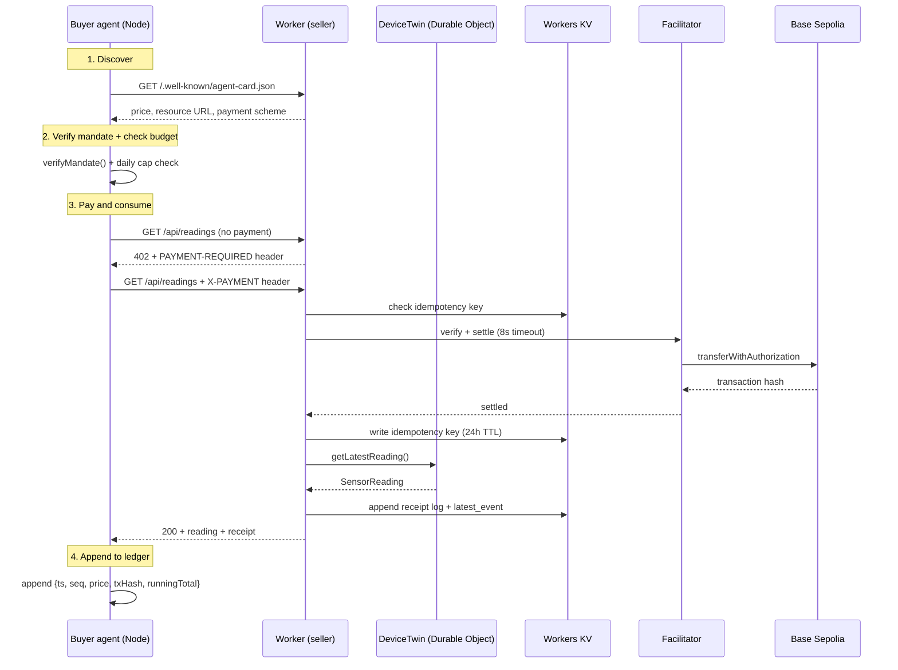

# x402-iot-poc

An HTTP endpoint that sells simulated IoT sensor readings to software agents — no account, no API key, no prior relationship. A request without payment returns `402 Payment Required` with machine-readable terms. The buyer signs an authorization, retries, and the payment settles on-chain before the data is served.

**Testnet only.** Everything runs on Base Sepolia with faucet USDC. These tokens have no real value, and no real-value settlement is wired anywhere in this repo.

- **Live endpoint:** `https://x402-iot-poc.akifk-x402-26.workers.dev`
- **Stack:** Cloudflare Workers · Hono · Durable Objects · Workers KV · x402 (`exact` scheme, EIP-3009) · Base Sepolia
- **License:** MIT

---

## Proof of settlement (Week 2)

Two independent settlements, both verifiable on the block explorer.

| # | Endpoint | Transaction |
| --- | --- | --- |
| 1 | Local (`wrangler dev`) | [`0xe18db476…4d1f3`](https://sepolia.basescan.org/tx/0xe18db4768d05030511485080ad850270b49e8a00df7965470a27ae2b93f4d1f3) |
| 2 | Public Worker | [`0xc5b68a95…3e92ff`](https://sepolia.basescan.org/tx/0xc5b68a953aa2ff89162a46c4a378d8c5fe35e3b86f77cf32dfbb4c2b403e92ff) |

| Parameter | Value |
| --- | --- |
| Network | Base Sepolia — `eip155:84532` |
| Price | $0.001 USDC per reading |
| Facilitator | `https://x402.org/facilitator` |
| Scheme | `exact` (EIP-3009 `transferWithAuthorization`) |

Full unpaid response, captured from a live server: [`docs/402-transcript.txt`](./docs/402-transcript.txt)

On the explorer, the `To` field shows the USDC contract rather than the seller address. That is expected: the buyer signs the authorization and the facilitator submits the transaction and pays the gas. The actual transfer appears under **ERC-20 Tokens Transferred**.

---

## Architecture (Week 3)



### Three-layer separation

| Layer | Responsibility |
|---|---|
| **Identity** | Agent Card at `/.well-known/agent-card.json` — who the seller is, what it sells, at what price |
| **Mandate** | Signed JSON document held by the buyer — authorized spending scope with cap and expiry |
| **Settlement** | x402 + EIP-3009 — actual on-chain payment; facilitator verifies and submits |

`DeviceTwin` knows **nothing** about money — it only produces and stores telemetry. The Worker layer owns pricing, payment verification, idempotency, receipts, and rate limiting.

---

## Quickstart

Requires Node 20+, a Cloudflare account (free tier), and two throwaway wallets.

**1. Clone and install**

```powershell
git clone https://github.com/Soresta/x402-iot-poc.git
cd x402-iot-poc
npm install
```

**2. Get two addresses and test USDC**

Create two accounts. The **buyer** needs test USDC; the **seller** needs nothing.

- Base Sepolia network (chain ID `84532`)
- Test USDC: [Circle faucet](https://faucet.circle.com/) · Test ETH: [Coinbase faucet](https://portal.cdp.coinbase.com/products/faucet)

The buyer does not need ETH. Gas is paid by the facilitator (EIP-3009).

**3. Configure the seller**

In `wrangler.jsonc` update `vars.PAY_TO` with your seller address. All other values can stay as defaults for local development.

**4. Configure the buyer**

```powershell
Copy-Item .env.example .env
```

Edit `.env`:

```
BUYER_PRIVATE_KEY=0xYOUR_TESTNET_KEY
SELLER_URL=http://127.0.0.1:8787
DAILY_CAP=0.05
MAX_PER_CALL=0.002
```

**5. Run the seller**

```powershell
npx wrangler dev
```

**6. Run the buyer agent** (second terminal)

```powershell
node buyer/agent.mjs
```

The agent will:
1. Discover the seller via the Agent Card
2. Create a signed mandate
3. Loop: verify mandate → check budget → pay → log receipt

**7. Watch the live demo**

Open `http://127.0.0.1:8787` in a browser. Settlement events appear live.

**8. Single-purchase mode** (legacy, Week 2)

```powershell
node buyer/pay.mjs   # set RESOURCE_URL in .env
```

**9. Deploy (optional)**

```powershell
npx wrangler deploy
```

Update `SELLER_URL` in `.env` to point at your deployed Worker URL.

---

## Configuration

### Seller (wrangler.jsonc `vars`)

| Variable | Default | Purpose |
| --- | --- | --- |
| `PAY_TO` | — | Seller address that receives payment |
| `FACILITATOR_URL` | `https://x402.org/facilitator` | Service that verifies and settles |
| `DEVICE_ID` | `sim-sensor-01` | Human-readable device name; DO instance key |
| `TICK_INTERVAL_MS` | `60000` | How often the DeviceTwin generates a new reading (ms); minimum 1000 |
| `PRICE_PER_READING` | `$0.001` | Price per `/api/readings` call |
| `RATE_LIMIT_QUOTA` | `10` | Max requests per buyer per window |
| `RATE_LIMIT_WINDOW_S` | `60` | Rate-limit window (seconds) |

### Buyer (`.env`)

| Variable | Secret | Purpose |
| --- | --- | --- |
| `BUYER_PRIVATE_KEY` | **Yes** | Signs payment authorizations |
| `RESOURCE_URL` | No | Target for single-purchase `buyer/pay.mjs` |
| `SELLER_URL` | No | Base URL for autonomous `buyer/agent.mjs` |
| `DAILY_CAP` | No | Max USDC per day (enforced before payment) |
| `MAX_PER_CALL` | No | Max USDC per single call |
| `MANDATE_EXPIRY_HOURS` | No | Hours until the mandate expires (default 24) |
| `LOOP_INTERVAL_MS` | No | Pause between purchases (ms, default 30000) |
| `BUYER_ENABLED` | No | Kill switch — set to `false` to stop the loop |

---

## Kill switch

Set `BUYER_ENABLED=false` in the terminal running the agent:

```powershell
$env:BUYER_ENABLED = "false"
```

The loop checks this at the **top of every iteration** and exits cleanly within one cycle. `Ctrl+C` also exits cleanly and flushes the ledger.

---

## Errors

All error responses follow this shape:

```json
{ "error": "machine_readable_code", "docs_url": "https://github.com/Soresta/x402-iot-poc#errors" }
```

See [`ERRORS.md`](./ERRORS.md) for the full error code catalogue.

---

## Project layout

```
├── src/
│   ├── index.ts         seller — Hono router; all routes and payment logic
│   ├── types.ts         shared interfaces (SensorReading, Env)
│   ├── device-twin.ts   DeviceTwin Durable Object; alarm-driven telemetry
│   ├── agent-card.ts    A2A Agent Card handler
│   └── demo.ts          live demo page + SSE endpoint
├── buyer/
│   ├── pay.mjs          single-purchase buyer (Week 2, preserved)
│   ├── mandate.mjs      createMandate(), verifyMandate()
│   └── agent.mjs        autonomous loop with cap + kill switch
├── docs/
│   ├── 402-transcript.txt  Week 2 payment proof
│   └── week3/
│       ├── BUILD-LOG.md    graded build log (all 6 blocks)
│       └── WEEK3-REPORT.md week 3 supervisor report
├── wrangler.jsonc          Worker config, DO binding, KV namespace
├── ERRORS.md               error code catalogue
└── .env.example            template for buyer secrets
```

---

## Known gotchas (collected across Week 2 and Week 3)

**1. The middleware must be built lazily on Workers.** Constructing the payment middleware at module scope fails, because Workers restricts cryptographic operations in the global scope. Build it inside the request handler instead:

```ts
let payment: MiddlewareHandler | undefined;
app.use(async (c, next) => {
  payment ??= paymentMiddleware(/* … */);
  return payment(c, next);
});
```

**2. Two incompatible package generations are in circulation.** The legacy family (`x402-hono`, `x402-fetch`) uses `network: "base-sepolia"`. The current scoped family (`@x402/hono`, `@x402/fetch`) uses CAIP-2 identifiers such as `eip155:84532`. Mixing them fails without a helpful error. This repo uses the scoped family throughout.

**3. Use `new_sqlite_classes`, not `new_classes`, for Durable Objects on the free plan.** `new_classes` causes a deploy-time error (`D1 database not found or permission denied`) on accounts without the paid Workers plan. `new_sqlite_classes` is the correct key for SQLite-backed DOs on all plan tiers.

**4. Idempotency write-after-settle risk.** The idempotency key is written to KV **after** the facilitator confirms settlement (not before). Residual risk: if the Worker crashes between settle and write, the same payment proof could be accepted again. The financial exposure is bounded (one free reading per crash scenario) and is accepted for this testnet PoC. A two-phase commit pattern would eliminate it but is out of scope here.

---

## Roadmap

- [x] x402-gated endpoint returning `402` with machine-readable terms
- [x] Buyer agent that signs, retries and settles on Base Sepolia
- [x] Public deployment with a settlement against the live endpoint
- [x] `DeviceTwin` Durable Object with scheduled telemetry
- [x] Idempotency — reject replayed payment proofs
- [x] Signed spending mandate with `max_per_call`, `daily_cap`, `expiry`
- [x] Agent Card at `/.well-known/agent-card.json` for A2A discovery
- [x] Live demo page with an event feed and running totals
- [x] Receipt log (`GET /api/receipts`) — verifiable on Base Sepolia
- [x] Per-buyer rate limiting
- [ ] Second resource type — pay-per-inference
- [ ] Dispute handling

---

## FAQ

**Can I lose real money running this?** No. Base Sepolia tokens come from a faucet and have no value. Use a throwaway wallet anyway — it is the habit that matters.

**Why does the buyer need no ETH?** The `exact` scheme uses EIP-3009: the buyer signs an authorization and the facilitator submits the transaction, paying gas.

**Why not just use an API key?** Because a key implies a prior relationship — an account, a contract, a billing setup. For a transaction worth a tenth of a cent, that overhead is larger than the transaction itself.

**Is this production-ready?** No. The sensor is simulated, the money has no value, and the limitations are listed explicitly above.

---

## License

MIT. See [`LICENSE`](./LICENSE).