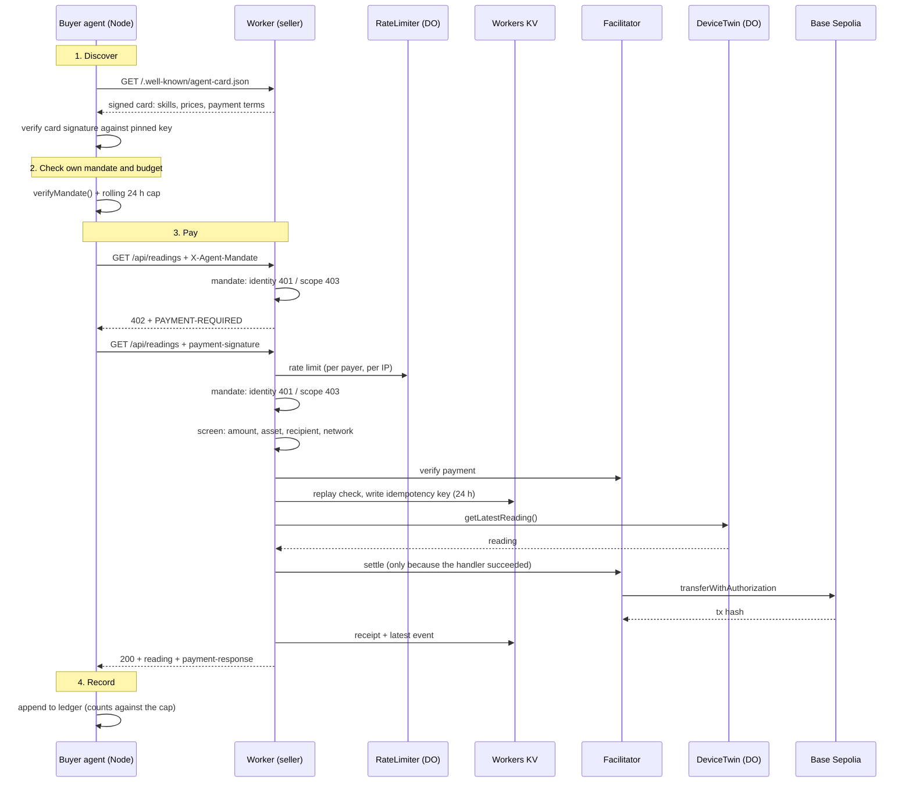

# x402-iot-poc

An HTTP API whose customers are software. It sells two things, simulated IoT sensor readings and model inferences, to autonomous agents that have no account, no API key and no prior relationship with it. A request without payment gets `402 Payment Required` with machine-readable terms. The buyer signs an authorization and retries, and the payment settles on-chain before anything is served.

**Testnet only.** Everything runs on Base Sepolia with faucet USDC. These tokens have no real value, and nothing in this repo is wired to real value.

- **Live endpoint:** `https://x402-iot-poc.akifk-x402-26.workers.dev` (open it in a browser for the live demo page)
- **Stack:** Cloudflare Workers · Hono · Durable Objects · Workers KV · Workers AI · x402 (`exact` scheme, EIP-3009) · Base Sepolia
- **Version:** `v1.1.0`. See [CHANGELOG.md](./CHANGELOG.md)
- **License:** MIT
- **Want to pay it yourself?** [QUICKSTART.md](./QUICKSTART.md): five minutes, testnet, no signup

### What is honest about this repo

Every defect found during the build is documented with the output that exposed it and has a regression test. There are sixteen, and almost none of them produced an error. Eleven of them are put back into the code by a script to prove the suite still catches them. The metric that would flatter this project most, payments from wallets we do not own, is computed in code that excludes our own addresses. It reads **0**.

- What was checked, and how: [`docs/VERIFICATION.md`](./docs/VERIFICATION.md)
- What is still wrong, missing or unverified: [`docs/OPEN-ITEMS.md`](./docs/OPEN-ITEMS.md)
- Map of every document in `docs/`: [`docs/README.md`](./docs/README.md)

---

## How a purchase works



The order matters, and this project got it wrong for six weeks. **The idempotency key is written in the handler, before settlement.** The middleware settles only when the handler returns a status below 400, so a failing request is never charged. See gotcha 4.

### Three layers

| Layer | Responsibility |
|---|---|
| **Identity** | Agent Card at `/.well-known/agent-card.json`: who the seller is, what it sells, at what price. Signed (A2A v1.0 §8.4 JWS format); the buyer verifies it against a pinned public key |
| **Mandate** | Signed JSON the buyer presents in `X-Agent-Mandate`: spending scope, cap and expiry. Checked by the buyer before spending and by the seller before serving. A bad signature or wrong holder is `401`; expired or out of scope is `403` |
| **Settlement** | x402 + EIP-3009. The buyer only signs; the facilitator verifies, submits and pays gas |

`DeviceTwin` knows **nothing** about money. It produces and stores telemetry. The Worker owns pricing, payment, idempotency, receipts and rate limiting.

---

## API

### Paid: the gate runs before anything is served

| Route | Price | Returns |
|---|---|---|
| `GET /api/readings` | `$0.001` | one sensor reading from the `DeviceTwin` Durable Object |
| `GET /api/inference?text=…` | `$0.002` | one sentiment classification on Workers AI |
| `GET /reading` | `$0.001` | the first x402 route (Week 2), preserved unchanged |

Both priced resources run one shared gate, in this order: input `400` → rate limit `429` → identity `401` / mandate `403` → payment screen `402` → facilitator verify → replay protection → the resource → settlement → receipt. A facilitator error is `503` with `Retry-After`. Sharing one gate means a control cannot exist on one route and be missing from the other.

### Free: discovery, negotiation and observability

| Route | Returns |
|---|---|
| `GET /.well-known/agent-card.json` | A2A Agent Card: both skills, prices, payment terms, signature |
| `GET /.well-known/jwks.json` | the card's public signing key |
| `GET /api/negotiate?resource=&offer=` | accept or decline a counter-offer, with the list price attached |
| `GET /api/receipts?limit=n` | settlement log: payer, amount, resource, tx hash |
| `GET /api/payers` | settlements per wallet, split into ours and external |
| `GET /api/metrics/daily?date=` | visits by source, settlements, volume, subscribers |
| `GET /api/feed/settlements` | SSE feed of settlements as they happen. `/api/events` is an alias, but some ad blockers block that name |
| `GET /api/device/status` · `GET /api/device/history?limit=n` | device twin health and ring buffer |
| `GET /` | live demo page |

### Write

| Route | Notes |
|---|---|
| `POST /api/subscribe` | consent-first email capture. An unticked consent box is a `400`, not a silent opt-in |
| `POST /api/visit` | aggregate visit counter. No IP, user agent, cookie or session is stored |
| `GET /api/subscribers.csv?token=` | subscriber export. **Fails closed**: `503` without `EXPORT_TOKEN` configured, `401` with a wrong token |

Every error has the shape `{ "error": "machine_readable_code", "docs_url": "…" }`. The full catalogue is in [`ERRORS.md`](./ERRORS.md).

---

## Run your own seller

> **Just want to pay the live one?** [QUICKSTART.md](./QUICKSTART.md) is the shorter path and needs no Cloudflare account. This section runs the whole thing yourself.

Requires Node 20+, a Cloudflare account (free tier) and two throwaway wallets.

**1. Clone and install**

```powershell
git clone https://github.com/Soresta/x402-iot-poc.git
cd x402-iot-poc
npm install
```

**2. Get two addresses and test USDC**

Create two accounts on Base Sepolia (chain ID `84532`). The **buyer** needs test USDC from the [Circle faucet](https://faucet.circle.com/). The **seller** needs nothing, and neither needs ETH, because the facilitator pays the gas. Never set up a wallet before? [QUICKSTART.md step 1](./QUICKSTART.md#1--get-a-wallet-test-usdc-and-the-private-key) walks through MetaMask: creating the account, adding Base Sepolia, the faucet, and exporting the private key.

**3. Configure the seller:** in `wrangler.jsonc`, set `vars.PAY_TO` to your seller address and add both addresses to `OWN_WALLETS`.

**4. Configure the buyer**

```powershell
Copy-Item .env.example .env
```

```
BUYER_PRIVATE_KEY=0xYOUR_TESTNET_KEY
SELLER_URL=http://127.0.0.1:8787
DAILY_CAP=0.05
MAX_PER_CALL=0.002
```

**5. Run the seller:** `npx wrangler dev`

**6. Run the buyer agent** in a second terminal: `node buyer/agent.mjs`

It discovers the seller, creates a signed mandate, then loops: check mandate → check budget → pay → record. `Ctrl+C` stops it cleanly.

**7. Watch it:** open `http://127.0.0.1:8787`. Each settlement appears in Live Events.

**8. Deploy (optional):** `npx wrangler deploy`, then point `SELLER_URL` at the deployed URL.

**9. Sign the Agent Card (optional):** `node scripts/generate-card-key.mjs --yes`. It stores the private key as a Worker secret without printing it, and prints the public key. Put that line in `.env` as `SELLER_CARD_PUBLIC_JWK`.

---

## Configuration

### Seller (`wrangler.jsonc` → `vars`)

| Variable | Default | Purpose |
| --- | --- | --- |
| `PAY_TO` | — | Seller address that receives payment |
| `FACILITATOR_URL` | `https://x402.org/facilitator` | Service that verifies and settles |
| `DEVICE_ID` | `sim-sensor-01` | Device name; the DeviceTwin instance key |
| `TICK_INTERVAL_MS` | `60000` | How often the DeviceTwin produces a reading; minimum 1000 |
| `PRICE_PER_READING` | `$0.001` | Price of `/api/readings` |
| `PRICE_PER_INFERENCE` | `$0.002` | Price of `/api/inference`. Higher on purpose, so `max_per_call` has a real decision to make |
| `RATE_LIMIT_QUOTA` / `RATE_LIMIT_WINDOW_S` | `10` / `60` | Requests per payer per window |
| `IP_RATE_LIMIT_QUOTA` | `60` | Per-IP backstop. The payer address is unverified when the limiter runs, so a per-payer quota alone could be walked past by rotating addresses |
| `USDC_ASSET` | Base Sepolia USDC | Asset the seller accepts |
| `REQUIRE_MANDATE` | `false` | `true` rejects requests without a mandate (`403`) |
| `OWN_WALLETS` | our two addresses | Addresses we control. Any payer **not** listed counts as external adoption |

### Seller secrets

| Secret | Purpose |
| --- | --- |
| `AGENT_CARD_SIGNING_KEY` | EC P-256 private JWK that signs the Agent Card. Create it with `scripts/generate-card-key.mjs`. Unset means an unsigned card and a `404` from `jwks.json` |
| `EXPORT_TOKEN` | Guards the subscriber export. Set with `npx wrangler secret put EXPORT_TOKEN`. Unset means the export returns `503` and exports nothing |

### Buyer (`.env`)

| Variable | Secret | Purpose |
| --- | --- | --- |
| `BUYER_PRIVATE_KEY` | **Yes** | Signs payment authorizations |
| `SELLER_URL` | No | Seller base URL. Default `http://127.0.0.1:8787` |
| `DAILY_CAP` | No | Max USDC over any rolling 24 hours |
| `MAX_PER_CALL` | No | Max USDC for one call |
| `MANDATE_EXPIRY_HOURS` | No | Mandate lifetime, default 24 |
| `LOOP_INTERVAL_MS` | No | Pause between purchases, default 30000 |
| `BUYER_ENABLED` | No | Kill switch. `false` stops the loop within one iteration |
| `SELLER_CARD_PUBLIC_JWK` | No | The seller's pinned **public** card key. Set: the agent refuses an unsigned or invalid card. Unset: it trusts TLS alone and prints a warning |
| `RESOURCE_URL` | No | Exact URL for the single-purchase `buyer/pay.mjs`. Unset: it buys `${SELLER_URL}/api/readings` |

---

## Verification

```bash
npm test                          # 81 tests: 52 regression, 29 over HTTP
node scripts/mutation-check.mjs   # put each known defect back; the suite must go red (11 of 11)
npx tsc --noEmit
```

The suite is not general coverage. It pins the defects that were actually found, plus the controls they had switched off. The payment-path scripts in `buyer/test_*.mjs` spend testnet USDC against a real facilitator.

**Where it stands** (full table in [`docs/VERIFICATION.md`](./docs/VERIFICATION.md)):

| | |
|---|---|
| Payment path, replay, screen codes, fail-closed | PASS, local and deployed |
| Rate limit under a 30-request concurrent burst | PASS: exactly 10 pass |
| Mandate identity and scope, seller binding | PASS |
| Signed Agent Card, clean `Ctrl+C`, explorer check by a person | PASS 2026-09-14, with [screenshots](./docs/evidence/) |
| Unattended run | **PARTIAL**: 1 h continuous. A second run spanned 8 h 50 m with ≈ 2 h 37 m of buying. Not 24 h |
| Stranger reproduces the README; stranger understands the demo | **NOT VERIFIED** |

---

## Project layout

```
├── src/                    the seller (Cloudflare Worker)
│   ├── index.ts            router: every route
│   ├── paid-route.ts       THE payment gate, shared by both priced resources
│   ├── mandate.ts          seller-side mandate verification (401 / 403)
│   ├── rate-limiter.ts     Durable Object limiter, exact under concurrency
│   ├── device-twin.ts      DeviceTwin Durable Object: alarm-driven telemetry
│   ├── inference.ts        pay-per-inference on Workers AI
│   ├── agent-card.ts       A2A Agent Card and JWKS
│   ├── card-signing.ts     JWS-over-JCS card signing (A2A v1.0 §8.4)
│   ├── negotiate.ts        price negotiation
│   ├── payers.ts           who paid: ours vs external
│   ├── metrics.ts          aggregate funnel counters, no identifiers
│   ├── subscribe.ts        consent-first email capture, fail-closed export
│   ├── demo.ts             live demo page and SSE feed
│   └── types.ts
├── buyer/                  the buyer (Node)
│   ├── agent.mjs           autonomous loop: mandate, cap, kill switch, negotiation
│   ├── budget.mjs          rolling 24 h spend
│   ├── mandate.mjs         create and verify mandates
│   ├── card-verify.mjs     verify the seller's card against a pinned key
│   ├── pay.mjs             single purchase (Week 2, preserved)
│   ├── soak.mjs            timed unattended run → docs/soak-runs/
│   ├── x402-harness.mjs    shared helper for the scripts below
│   └── test_*.mjs          manual checks against a real facilitator
├── test/                   vitest: regressions.spec.ts, http.spec.ts
├── scripts/                mutation-check · generate-card-key · backup-kv
├── docs/                   verification, open items, weekly logs, memos,
│                           content drafts, evidence (map: docs/README.md)
├── wrangler.jsonc          Worker config: DOs, KV, AI, vars
├── QUICKSTART.md           pay the live API in five minutes
├── ERRORS.md               error code catalogue
├── CHANGELOG.md            every change, and which defect it fixed
└── AGENTS.md               read before letting an AI agent change the payment path
```

---

## Known gotchas: things that cost real time here

**1. Build the payment middleware lazily on Workers.** Constructing it at module scope fails, because Workers restricts cryptographic operations in the global scope. Build it inside the request handler:

```ts
let payment: MiddlewareHandler | undefined;
app.use(async (c, next) => {
  payment ??= paymentMiddleware(/* … */);
  return payment(c, next);
});
```

**2. Two incompatible x402 package generations are in circulation.** The legacy family (`x402-hono`, `x402-fetch`) uses `network: "base-sepolia"`. The scoped family (`@x402/hono`, `@x402/fetch`) uses CAIP-2 identifiers such as `eip155:84532`. Mixing them fails without a helpful error. This repo uses the scoped family.

**3. The payment proof arrives in `payment-signature`, not `X-PAYMENT`.** The scoped v2 client sends `payment-signature`; the older family used `X-PAYMENT`. Logic keyed on `X-PAYMENT` alone (idempotency, rate limiting, logging) silently never runs, and the request still settles, so everything looks healthy. This repo accepts both names.

**4. The middleware settles *after* your handler, and only if it succeeded.** It verifies, runs the handler, and settles only for a status below 400; otherwise it cancels. So:

- **A failing handler does not charge the buyer.** Verified on-chain: two paid requests against a broken device returned `503`, and the buyer's balance did not change.
- **The replay key is written before settlement**, because it is written in the handler. The genuine side effect runs the other way: a proof can be used up without a charge, and a retry with that same proof gets `payment_already_used`. The client re-signs on the next `402`, so this costs a round trip, not money.

**5. Use `new_sqlite_classes`, not `new_classes`, for Durable Objects on the free plan.** `new_classes` fails at deploy time with a misleading `D1 database not found or permission denied`.

**6. A KV-backed rate limiter does not hold under concurrency.** KV read-count-write is not atomic, and KV reads are eventually consistent. This repo's first limiter passed every sequential test and let **30 of 30** simultaneous requests through a quota of 10. A Durable Object processes one event at a time, and the same burst lets exactly 10 through. Test bursts, not just request 11.

**7. `payment-response` is set on failures too.** The middleware sets it on a failed settlement as well (`success: false`). Record a sale only when `success` is `true` and there is a transaction hash.

**8. A buyer can pay and never hear back.** If the network drops mid-request, the seller may settle while the client sees `fetch failed`. The buyer here counts such a payment against its cap as `payment_unconfirmed`. For a cap, overcounting is the safe way to be wrong.

**9. Workers SSE streams need a cursor.** A Worker response cannot stay open indefinitely, so the feed closes every 25 s and the page reconnects. A stream without a cursor replays the latest event on every reconnect. Here the page sends `?since=`, and the server announces its planned close.

**10. Ad blockers block `/api/events`.** Some tracker filter lists treat it as an analytics endpoint, so an SSE feed at that path never connects in those browsers, with only `net::ERR_BLOCKED_BY_CLIENT` in the console. The feed here lives at `/api/feed/settlements`.

**11. Only run one `wrangler dev` at a time.** Two instances against the same local Durable Object database produce `SQLITE_BUSY`, and the error does not mention the real problem.

**12. `sepolia.basescan.org` challenges automated browsers.** To check a settlement from a script, read the chain:

```bash
curl -sS -X POST https://sepolia.base.org -H "Content-Type: application/json" -d '{"jsonrpc":"2.0","id":1,"method":"eth_getTransactionReceipt","params":["0xTXHASH"]}'
```

The ERC-20 `Transfer` is the **second** log. The first is `AuthorizationUsed`, whose second topic is the EIP-3009 nonce, not an address. On the explorer page, the transaction's `From` is the facilitator's relayer, and buyer → seller appears under **ERC-20 Tokens Transferred**.

---

## Still open

External adoption (no wallet we do not own has paid), a 24-hour continuous run, the stranger tests, and dispute handling. Each item, with what "done" looks like: [`docs/OPEN-ITEMS.md`](./docs/OPEN-ITEMS.md).

The first settlements (Week 2), [local](https://sepolia.basescan.org/tx/0xe18db4768d05030511485080ad850270b49e8a00df7965470a27ae2b93f4d1f3) and [on the public Worker](https://sepolia.basescan.org/tx/0xc5b68a953aa2ff89162a46c4a378d8c5fe35e3b86f77cf32dfbb4c2b403e92ff), are kept with the raw unpaid response they started from: [`docs/evidence/week2-402-transcript.txt`](./docs/evidence/week2-402-transcript.txt).

---

## FAQ

**Can I lose real money running this?** No. Base Sepolia tokens come from a faucet and have no value. Use a throwaway wallet anyway; the habit is what matters.

**Why does the buyer need no ETH?** EIP-3009: the buyer signs an authorization, and the facilitator submits the transaction and pays the gas.

**Why not just use an API key?** A key implies a prior relationship: an account, a contract, a billing setup. For a transaction worth a tenth of a cent, that overhead costs more than the transaction.

**Is this production-ready?** No. The sensor is simulated, the money has no value, and the gaps are listed in [`docs/OPEN-ITEMS.md`](./docs/OPEN-ITEMS.md).

**Has anyone outside the project paid it?** No. `GET /api/payers` reports `external_payers: 0`, computed by excluding `OWN_WALLETS` in code rather than by anyone's judgement.

**Why is inference more expensive than a reading?** Compute costs more than a stored measurement, and the gap gives `max_per_call` a real decision to make. A mandate authorized for `$0.001` gets `403 mandate_scope_exceeded` when it reaches for the `$0.002` inference.

**Is x402 safe to build on?** Read the limitations first. Three 2026 papers document real attacks on x402 implementations, and an independent assessment found security violations in every facilitator it evaluated. Scores and sources: [`docs/research-board/AGENTIC-PAYMENTS-BOARD.md`](./docs/research-board/AGENTIC-PAYMENTS-BOARD.md).

---

## License

MIT. See [`LICENSE`](./LICENSE).
