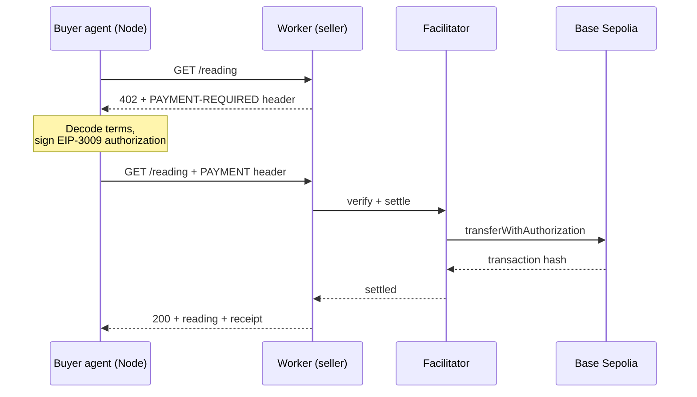

# x402-iot-poc

An HTTP endpoint that sells simulated IoT sensor readings to software agents — no account, no API key, no prior relationship. A request without payment returns `402 Payment Required` with machine-readable terms. The buyer signs an authorization, retries, and the payment settles on-chain before the data is served.

**Testnet only.** Everything runs on Base Sepolia with faucet USDC. These tokens have no real value, and no real-value settlement is wired anywhere in this repo.

- **Live endpoint:** `https://x402-iot-poc.akifk-x402-26.workers.dev/reading`
- **Stack:** Cloudflare Workers · Hono · x402 (`exact` scheme, EIP-3009) · Base Sepolia
- **License:** MIT

---

## Proof of settlement

Two independent settlements, both verifiable on the block explorer.

| # | Endpoint | Transaction |
| --- | --- | --- |
| 1 | Local (`wrangler dev`) | [`0xe18db476…4d1f3`](https://sepolia.basescan.org/tx/0xe18db4768d05030511485080ad850270b49e8a00df7965470a27ae2b93f4d1f3) |
| 2 | Public Worker | [`0xc5b68a95…3e92ff`](https://sepolia.basescan.org/tx/0xc5b68a953aa2ff89162a46c4a378d8c5fe35e3b86f77cf32dfbb4c2b403e92ff) |

| Parameter | Value |
| --- | --- |
| Network | Base Sepolia — `eip155:84532` |
| Price | $0.001 USDC per reading |
| Facilitator | `https://x402.org/facilitator` |
| Scheme | `exact` (EIP-3009 `transferWithAuthorization`) |

Full unpaid response, captured from a live server: [`docs/402-transcript.txt`](./docs/402-transcript.txt)

On the explorer, the `To` field shows the USDC contract rather than the seller address. That is expected: the buyer signs the authorization and the facilitator submits the transaction and pays the gas. The actual transfer appears under **ERC-20 Tokens Transferred**.

---

## How it works



The seller never holds a private key and never touches the chain directly. It only asks the facilitator whether a payment is valid, and refuses to serve until the answer is yes.

---

## Quickstart

Requires Node 20+, a Cloudflare account (free tier is enough), and a throwaway wallet.

**1. Clone and install**

```bash
git clone https://github.com/Soresta/x402-iot-poc.git
cd x402-iot-poc
npm install
```

**2. Get two addresses and some test USDC**

Create two accounts in any wallet. The first is the **buyer** and needs test USDC; the second is the **seller** and needs nothing at all.

- Add the Base Sepolia network (chain ID `84532`)
- Test USDC: [Circle faucet](https://faucet.circle.com/) · Test ETH (optional): [Coinbase Developer Platform faucet](https://portal.cdp.coinbase.com/products/faucet)

The buyer does not need ETH. Gas is paid by the facilitator — that is what EIP-3009 buys you.

**3. Configure the seller**

In `wrangler.jsonc`:

```jsonc
"vars": {
  "PAY_TO": "0xYOUR_SELLER_ADDRESS",
  "FACILITATOR_URL": "https://x402.org/facilitator"
}
```

**4. Configure the buyer**

Copy `.env.example` to `.env` and fill it in. `.env` is gitignored — keep it that way even for worthless testnet keys.

```
BUYER_PRIVATE_KEY=0x...
RESOURCE_URL=http://127.0.0.1:8787/reading
```

**5. Run**

```bash
npx wrangler dev
```

In a **second** terminal — leave the first one alone, it treats keystrokes as shortcuts:

```bash
curl -sS -i http://127.0.0.1:8787/reading   # expect: HTTP/1.1 402 Payment Required
node buyer/pay.mjs                          # expect: status 200 + a transaction hash
```

**6. Deploy (optional)**

```bash
npx wrangler deploy
```

Then point `RESOURCE_URL` at `https://<your-worker>.workers.dev/reading` and run the buyer again.

---

## Configuration

| Variable | Where | Secret | Purpose |
| --- | --- | --- | --- |
| `PAY_TO` | `wrangler.jsonc` → `vars` | No | Seller address that receives payment |
| `FACILITATOR_URL` | `wrangler.jsonc` → `vars` | No | Service that verifies and settles |
| `BUYER_PRIVATE_KEY` | `.env` | **Yes** | Signs the buyer's payment authorization |
| `RESOURCE_URL` | `.env` | No | Endpoint the buyer pays |

---

## Two things that cost me time

Neither is documented anywhere I could find, so they are recorded here.

**1. The middleware must be built lazily on Workers.** Constructing the payment middleware at module scope fails, because Workers restricts cryptographic operations in the global scope. Build it inside the request handler instead:

```ts
let payment: MiddlewareHandler | undefined;

app.use(async (c, next) => {
  payment ??= paymentMiddleware(/* … */);
  return payment(c, next);
});
```

**2. Two incompatible package generations are in circulation.** The legacy family (`x402-hono`, `x402-fetch`) uses `network: "base-sepolia"`. The current scoped family (`@x402/hono`, `@x402/fetch`) uses CAIP-2 identifiers such as `eip155:84532`. Vendor documentation is split between them and mixing a server from one with a client from the other fails without a helpful error. This repo uses the scoped family throughout.

---

## Project layout

```
├── src/index.ts        seller — Hono app, x402-gated /reading route
├── buyer/pay.mjs       buyer  — discovers terms, signs, retries, logs the tx
├── docs/               captured proof (402 transcript)
├── wrangler.jsonc      Worker config and non-secret vars
└── .env.example        template for the buyer's secrets
```

---

## Scope and limitations

Stated plainly, because a demo that overstates itself is worth less than one that does not:

- **The sensor is simulated.** Values are generated in the Worker; no hardware exists.
- **The money has no value.** Faucet USDC on a testnet, by design and by policy.
- **No replay protection yet.** A payment proof is not currently checked against a used-proof store. This is the next change.
- **No mandate layer yet.** The buyer has no signed spending authorization with caps and an expiry. Also next.
- **No rate limiting, no dispute handling.** Both are known gaps rather than oversights.

What is real: the discovery of terms, the signature, the facilitator verification, the on-chain settlement and the receipt. The claim under test is not *this device exists* — it is *when a device does exist, this is the mechanism that lets it sell to strangers*.

---

## Roadmap

- [x] x402-gated endpoint returning `402` with machine-readable terms
- [x] Buyer agent that signs, retries and settles on Base Sepolia
- [x] Public deployment with a settlement against the live endpoint
- [ ] `DeviceTwin` Durable Object with scheduled telemetry
- [ ] Idempotency — reject replayed payment proofs
- [ ] Signed spending mandate with `max_per_call`, `daily_cap`, `expiry`
- [ ] Agent Card at `/.well-known/agent-card.json` for A2A discovery
- [ ] Live demo page with an event feed and running totals
- [ ] Second resource type — pay-per-inference

---

## FAQ

**Can I lose real money running this?** No. Base Sepolia tokens come from a faucet and have no value. Use a throwaway wallet anyway — it is the habit that matters.

**Why does the buyer need no ETH?** The `exact` scheme uses EIP-3009: the buyer signs an authorization and the facilitator submits the transaction, paying gas.

**Why not just use an API key?** Because a key implies a prior relationship — an account, a contract, a billing setup. For a transaction worth a tenth of a cent, that overhead is larger than the transaction. This repo exists to test whether removing it changes what can be sold.

**Is this production-ready?** No, and the limitations section says why.

---

## License

MIT. See [`LICENSE`](./LICENSE).