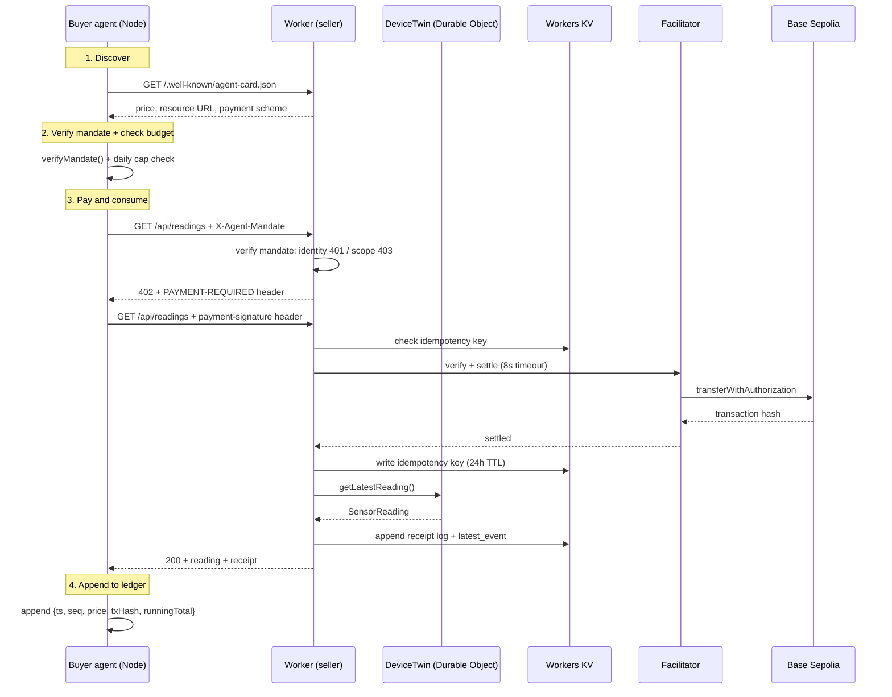

# x402-iot-poc

An HTTP API whose customers are software. It sells two things — simulated IoT sensor readings and model inferences — to autonomous agents with no account, no API key and no prior relationship. A request without payment returns `402 Payment Required` with machine-readable terms; the buyer signs an authorization, retries, and the payment settles on-chain before anything is served.

**Testnet only.** Everything runs on Base Sepolia with faucet USDC. These tokens have no real value, and no real-value settlement is wired anywhere in this repo.

- **Live endpoint:** `https://x402-iot-poc.akifk-x402-26.workers.dev`
- **Stack:** Cloudflare Workers · Hono · Durable Objects · Workers KV · Workers AI · x402 (`exact` scheme, EIP-3009) · Base Sepolia
- **Version:** `v1.0.0` — see [CHANGELOG.md](./CHANGELOG.md)
- **License:** MIT
- **Want to pay it yourself?** [QUICKSTART.md](./QUICKSTART.md) — five minutes, testnet, no signup

### What is honest about this repo

Four defects reached production during the build. Each is documented with the
output that exposed it, in the version where it was fixed, and each now has a
regression test. The one metric that would flatter this project — payments from
wallets we do not own — is computed in code that excludes our own addresses, and
it reads **0**.

Everything still wrong, missing or unverified is in one list:
[`docs/OPEN-ITEMS.md`](./docs/OPEN-ITEMS.md).

---

## Proof of settlement (Week 2)

Two independent settlements, both verifiable on the block explorer.

| # | Endpoint | Transaction |
| --- | --- | --- |
| 1 | Local (`wrangler dev`) | [`0xe18db476…4d1f3`](https://sepolia.basescan.org/tx/0xe18db4768d05030511485080ad850270b49e8a00df7965470a27ae2b93f4d1f3) |
| 2 | Public Worker | [`0xc5b68a95…3e92ff`](https://sepolia.basescan.org/tx/0xc5b68a953aa2ff89162a46c4a378d8c5fe35e3b86f77cf32dfbb4c2b403e92ff) |

| Parameter | Value |
| --- | --- |
| Network | Base Sepolia — `eip155:84532` |
| Price | $0.001 USDC per reading |
| Facilitator | `https://x402.org/facilitator` |
| Scheme | `exact` (EIP-3009 `transferWithAuthorization`) |

Full unpaid response, captured from a live server: [`docs/402-transcript.txt`](./docs/402-transcript.txt)

On the explorer, the `To` field shows the USDC contract rather than the seller address. That is expected: the buyer signs the authorization and the facilitator submits the transaction and pays the gas. The actual transfer appears under **ERC-20 Tokens Transferred**.

---

## Architecture



### Three-layer separation

| Layer | Responsibility |
|---|---|
| **Identity** | Agent Card at `/.well-known/agent-card.json` — who the seller is, what it sells, at what price |
| **Mandate** | Signed JSON document presented by the buyer in `X-Agent-Mandate` — authorized spending scope with cap and expiry. Verified by the seller on every request: bad signature or wrong holder is `401`, expired or out-of-scope is `403` |
| **Settlement** | x402 + EIP-3009 — actual on-chain payment; facilitator verifies and submits |

The buyer checks its own mandate before spending; the seller checks it again before serving. Buyer-side checking alone is an honour system, so both sides do it.

`DeviceTwin` knows **nothing** about money — it only produces and stores telemetry. The Worker layer owns pricing, payment verification, idempotency, receipts, and rate limiting.

---

## API

Two priced resources, and everything else is free and public.

### Paid — payment required, verified before anything is served

| Route | Price | Returns |
|---|---|---|
| `GET /api/readings` | `$0.001` | one sensor reading from the `DeviceTwin` Durable Object |
| `GET /api/inference?text=…` | `$0.002` | one sentiment classification on Workers AI |
| `GET /reading` | `$0.001` | Week 2 legacy route, preserved unchanged as an evidence artefact |

Both paid routes run the same gate — rate limit, identity, mandate, payment
screen, settlement, replay protection, receipt, fail-closed — because they share
one middleware rather than a copy of it.

### Free — discovery, negotiation and observability

| Route | Returns |
|---|---|
| `GET /.well-known/agent-card.json` | A2A Agent Card: both skills, prices, payment terms. Signed (A2A v1.0 §8.4 JWS format) when a signing key is configured |
| `GET /.well-known/jwks.json` | the card's public signing key — `404 card_signing_not_configured` until one exists |
| `GET /api/negotiate?resource=&offer=` | accept or decline a counter-offer, with the list price attached |
| `GET /api/receipts?limit=n` | settlement log — payer, amount, resource, tx hash |
| `GET /api/payers` | settlements per wallet, split into ours and external |
| `GET /api/metrics/daily?date=` | visits by source, settlements, volume, subscribers |
| `GET /api/events` | SSE feed of settlements as they happen |
| `GET /api/device/status` · `GET /api/device/history?limit=n` | device twin health and ring buffer |
| `GET /` | live demo page |

### Write endpoints

| Route | Notes |
|---|---|
| `POST /api/subscribe` | consent-first email capture. An unticked consent box is a `400`, not a silent opt-in |
| `POST /api/visit` | aggregate visit counter. No IP, user agent, cookie or session is stored |
| `GET /api/subscribers.csv?token=` | subscriber export. **Fails closed** — without `EXPORT_TOKEN` it returns `503` and exports nothing |

---

## Run your own seller

> **Just want to pay the live one?** That is a different, shorter path:
> [QUICKSTART.md](./QUICKSTART.md) — five minutes, no Cloudflare account needed.
> This section is for running the whole thing yourself.

Requires Node 20+, a Cloudflare account (free tier), and two throwaway wallets.

**1. Clone and install**

```powershell
git clone https://github.com/Soresta/x402-iot-poc.git
cd x402-iot-poc
npm install
```

**2. Get two addresses and test USDC**

Create two accounts. The **buyer** needs test USDC; the **seller** needs nothing.

- Base Sepolia network (chain ID `84532`)
- Test USDC: [Circle faucet](https://faucet.circle.com/) · Test ETH: [Coinbase faucet](https://portal.cdp.coinbase.com/products/faucet)

The buyer does not need ETH. Gas is paid by the facilitator (EIP-3009).

**3. Configure the seller**

In `wrangler.jsonc` update `vars.PAY_TO` with your seller address. All other values can stay as defaults for local development.

**4. Configure the buyer**

```powershell
Copy-Item .env.example .env
```

Edit `.env`:

```
BUYER_PRIVATE_KEY=0xYOUR_TESTNET_KEY
SELLER_URL=http://127.0.0.1:8787
DAILY_CAP=0.05
MAX_PER_CALL=0.002
```

**5. Run the seller**

```powershell
npx wrangler dev
```

**6. Run the buyer agent** (second terminal)

```powershell
node buyer/agent.mjs
```

The agent will:
1. Discover the seller via the Agent Card
2. Create a signed mandate
3. Loop: verify mandate → check budget → pay → log receipt

**7. Watch the live demo**

Open `http://127.0.0.1:8787` in a browser. Settlement events appear live.

**8. Single-purchase mode** (legacy, Week 2)

```powershell
node buyer/pay.mjs   # set RESOURCE_URL in .env
```

**9. Deploy (optional)**

```powershell
npx wrangler deploy
```

Update `SELLER_URL` in `.env` to point at your deployed Worker URL.

---

## Configuration

### Seller (wrangler.jsonc `vars`)

| Variable | Default | Purpose |
| --- | --- | --- |
| `PAY_TO` | — | Seller address that receives payment |
| `FACILITATOR_URL` | `https://x402.org/facilitator` | Service that verifies and settles |
| `DEVICE_ID` | `sim-sensor-01` | Human-readable device name; DO instance key |
| `TICK_INTERVAL_MS` | `60000` | How often the DeviceTwin generates a new reading (ms); minimum 1000 |
| `PRICE_PER_READING` | `$0.001` | Price per `/api/readings` call |
| `PRICE_PER_INFERENCE` | `$0.002` | Price per `/api/inference` call — higher on purpose, so `max_per_call` has a real decision to make |
| `RATE_LIMIT_QUOTA` | `10` | Max requests per buyer per window |
| `RATE_LIMIT_WINDOW_S` | `60` | Rate-limit window (seconds) |
| `IP_RATE_LIMIT_QUOTA` | `60` | Per-IP backstop per window. The payer address in a proof is unverified when the limiter runs, so a per-payer quota alone can be walked past by rotating fake addresses |
| `USDC_ASSET` | Base Sepolia USDC | Asset the seller will accept |
| `REQUIRE_MANDATE` | `false` | `true` rejects requests carrying no mandate with `403` |
| `OWN_WALLETS` | our two addresses | Comma-separated addresses we control. A payer **not** on this list counts as external adoption — keeping it in config is what stops a wallet we funded ourselves being counted as a stranger |

### Seller secret

| Secret | Purpose |
| --- | --- |
| `AGENT_CARD_SIGNING_KEY` | EC P-256 private JWK that signs the Agent Card. Create it with `node scripts/generate-card-key.mjs --yes`, which pipes it into `wrangler secret put` **without printing it** and prints only the public key. Unset means the card is served unsigned |
| `EXPORT_TOKEN` | Guards `GET /api/subscribers.csv`. Set with `npx wrangler secret put EXPORT_TOKEN`. **Unset means the export returns `503` and exports nothing** — an unprotected export endpoint on a public Worker is an email list published to the internet |

### Buyer (`.env`)

| Variable | Secret | Purpose |
| --- | --- | --- |
| `BUYER_PRIVATE_KEY` | **Yes** | Signs payment authorizations |
| `RESOURCE_URL` | No | Target for single-purchase `buyer/pay.mjs` |
| `SELLER_URL` | No | Base URL for autonomous `buyer/agent.mjs` |
| `DAILY_CAP` | No | Max USDC per day (enforced before payment) |
| `MAX_PER_CALL` | No | Max USDC per single call |
| `MANDATE_EXPIRY_HOURS` | No | Hours until the mandate expires (default 24) |
| `LOOP_INTERVAL_MS` | No | Pause between purchases (ms, default 30000) |
| `BUYER_ENABLED` | No | Kill switch — set to `false` to stop the loop |
| `SELLER_CARD_PUBLIC_JWK` | No | The seller's card-signing **public** key, pinned. Set → the agent refuses to buy from an unsigned or invalid card. Unset → it trusts the card on TLS alone and prints a warning saying so |

---

## Kill switch

Set `BUYER_ENABLED=false` in the terminal running the agent:

```powershell
$env:BUYER_ENABLED = "false"
```

The loop checks this at the **top of every iteration** and exits cleanly within one cycle — verified.

`Ctrl+C` is handled by a `SIGINT` handler that appends a stop record to the
ledger. On Windows this handler was not observed running when the signal was
sent programmatically (Node terminates the process instead), so the graceful
path is **not** claimed as verified. The ledger is append-only and one line per
purchase, so it survives an abrupt stop intact — that part was checked.

---

## Errors

All error responses follow this shape:

```json
{ "error": "machine_readable_code", "docs_url": "https://github.com/Soresta/x402-iot-poc#errors" }
```

See [`ERRORS.md`](./ERRORS.md) for the full error code catalogue.

---

## Verification

### Automated

```bash
npm test                        # vitest — 72 tests: 47 regression, 25 over HTTP
node scripts/mutation-check.mjs # put each known defect back; the suite must go red
npx tsc --noEmit  # typecheck
```

The suite is not general coverage. It is **one test per defect that actually
reached production**, plus the controls those defects switched off. Each of the
four was deliberately reintroduced to confirm the suite goes red; all four were
caught.

One of them proved itself by accident. A mutation script crashed after writing a
mutation and before restoring the file, leaving the payment-header bug back in
the working tree — the one that left replay protection and rate limiting inert
for a week in Week 3. The suite failed immediately, unprompted:

```text
FAIL  regression 1: payment proof header name
      > reads the header the current client actually sends
AssertionError: expected undefined to be 'abc'
```

That defect survived a week of manual testing the first time. It survived about
ninety seconds the second time.

### Manual — these spend or move real testnet USDC where noted

```bash
node buyer/test_replay.mjs              # pay, then replay the same proof   → 402   (spends)
node buyer/test_fresh_after_replay.mjs  # replay protection must not block honest buyers (spends)
node buyer/test_inference.mjs           # both resources, one card, scope enforced (spends)
node buyer/test_mandate.mjs             # identity 401 / mandate 403, seven cases (spends 1)
node buyer/test_negative.mjs            # underpayment, wrong asset         → 402 + code
node buyer/test_ratelimit.mjs --recover # quota breach → 429, then recovery
node buyer/test_ratelimit_burst.mjs     # 30 concurrent → exactly 10 pass
node buyer/test_failclosed.mjs          # facilitator unreachable           → 503
node buyer/soak.mjs                     # timed unattended run
node scripts/backup-kv.mjs              # dump KV to backups/ (contains subscriber emails)
```

Add `SELLER_URL=https://x402-iot-poc.akifk-x402-26.workers.dev` to run any of
them against the deployed Worker. **Wait 60 s between runs of
`test_mandate.mjs`** — it otherwise trips our own rate limiter.

### Results

| Check | Result |
|---|---|
| Paid request returns data; replayed proof rejected | PASS — local and deployed |
| Underpayment / wrong asset / wrong recipient | PASS — `402` with a distinct code each |
| Rate-limit breach and recovery | PASS — `429` + `Retry-After`, releases after the window |
| Rate limit under a concurrent burst | PASS **since 2026-09-11** — 30 simultaneous requests, exactly 10 pass, on the deployed Worker. Before the fix: 30 of 30 passed |
| Failed paid request is not charged | PASS — two paid requests against a broken device, buyer balance unchanged on-chain |
| A failed settlement is not counted as a sale | PASS **since 2026-09-11** — deployed Worker went from 100 settlements / $0.101 to the true 97 / $0.098 |
| Facilitator unreachable | PASS — `503` + `Retry-After: 5`, no telemetry served |
| Forced `DeviceTwin` failure | PASS — structured `503`, no stack trace |
| Budget cap, kill switch, price above mandate | PASS — refused before any payment |
| Expired mandate · scope exceeded · malformed · bad caps | PASS — `403`, seller-side |
| Tampered or foreign mandate signature | PASS — `401 identity_unverified` |
| Mandate presented by a different payer | PASS — `401 identity_mismatch` |
| Mandate addressed to a different seller | PASS — `403 mandate_wrong_seller` |
| Both resources sold; cheap mandate cannot buy compute | PASS — local and deployed |
| Price negotiation: counter-offer accepted / declined | PASS — local and deployed |
| Consent required · export fails closed | PASS — `400` without consent, `503` without a token |
| Unattended run | PARTIAL — 1 h, 111 settlements, 98.2 % success. 24 h not attempted |
| Demo page comprehension by a stranger | NOT VERIFIED |
| README reproduced by a stranger in ≤15 min | NOT VERIFIED |
| Graceful `Ctrl+C` exit | PARTIAL — ledger intact, handler unobserved on Windows |

The `NOT VERIFIED` and `PARTIAL` rows need a person rather than a script, and the
exact steps are in [`docs/PENDING-HUMAN-TESTS.md`](./docs/PENDING-HUMAN-TESTS.md).

### The four defects

All four returned well-formed responses and threw nothing:

| # | Defect | Why it was invisible |
|---|---|---|
| 1 | Seller read `X-PAYMENT`; the client sends `payment-signature` | Payments settled perfectly while replay protection and rate limiting never ran. The replay test passed — the rejection came from the chain, not from us |
| 2 | Mandate verified on the buyer only | Every test passed. A compromised agent simply skips its own check |
| 3 | A valid mandate worked for whoever held it | Signature and expiry both check out; nothing bound the holder to the payer |
| 4 | Classifier reported the least likely label | The model returns classes in fixed order, not sorted by confidence |

Full write-ups with the failing output: [`docs/week3/BUILD-LOG.md`](./docs/week3/BUILD-LOG.md)
Block 7, [`docs/week5/BUILD-LOG.md`](./docs/week5/BUILD-LOG.md) Block 2, and
[`docs/week8/BUILD-LOG.md`](./docs/week8/BUILD-LOG.md).

---

## Project layout

```
├── src/
│   ├── index.ts         Hono router — every route lives here
│   ├── types.ts         shared interfaces (SensorReading, Env)
│   ├── paid-route.ts    THE payment gate, shared by every priced resource
│   ├── rate-limiter.ts  Durable Object limiter — exact under concurrency
│   ├── card-signing.ts  JWS-over-JCS Agent Card signing (A2A v1.0 §8.4 format)
│   ├── mandate.ts       seller-side mandate verification (401 / 403)
│   ├── device-twin.ts   DeviceTwin Durable Object; alarm-driven telemetry
│   ├── inference.ts     pay-per-inference on Workers AI
│   ├── negotiate.ts     A2A price negotiation
│   ├── payers.ts        who paid, split into ours and external
│   ├── metrics.ts       aggregate funnel counters (no identifiers stored)
│   ├── subscribe.ts     consent-first email capture + fail-closed CSV export
│   ├── agent-card.ts    A2A Agent Card handler
│   └── demo.ts          live demo page + SSE endpoint
├── buyer/
│   ├── pay.mjs          single-purchase buyer (Week 2, preserved)
│   ├── agent.mjs        autonomous loop: mandate, cap, kill switch, negotiation
│   ├── mandate.mjs      createMandate(), verifyMandate()
│   ├── card-verify.mjs  verify the seller's card against a pinned key
│   ├── soak.mjs         timed unattended run; reports real elapsed time
│   ├── x402-harness.mjs shared test helper (captures the payment header)
│   └── test_*.mjs       replay, fresh-after-replay, negative, rate limit,
│                        fail-closed, mandate, inference
├── test/
│   ├── regressions.spec.ts   47 tests, one group per defect that shipped
│   └── http.spec.ts          25 tests through SELF.fetch — real routing, real DOs
├── scripts/
│   ├── backup-kv.mjs    dump KV to backups/ — the only backup that exists
│   ├── mutation-check.mjs   reintroduce each known defect, expect a red suite
│   └── generate-card-key.mjs create the card signing key without displaying it
├── docs/
│   ├── OPEN-ITEMS.md          every known gap, in one list
│   ├── PENDING-HUMAN-TESTS.md checks a script cannot run
│   ├── week3…week9/           build log + report per week
│   ├── memos/                 real-value readiness · revenue impact · funnel fixes
│   ├── research-board/        agentic-payments readiness board
│   ├── content/               every unpublished asset
│   └── metrics/BASELINE.md    KPI baseline the programme is measured against
├── wrangler.jsonc       Worker config: DO, KV, AI, vars
├── QUICKSTART.md        pay the live API in five minutes
├── CHANGELOG.md         what changed, and which defects were fixed where
├── ERRORS.md            error code catalogue
└── .env.example         template for buyer secrets
```

---

## Known gotchas — things that cost real time here

**1. The middleware must be built lazily on Workers.** Constructing the payment middleware at module scope fails, because Workers restricts cryptographic operations in the global scope. Build it inside the request handler instead:

```ts
let payment: MiddlewareHandler | undefined;
app.use(async (c, next) => {
  payment ??= paymentMiddleware(/* … */);
  return payment(c, next);
});
```

**2. Two incompatible package generations are in circulation.** The legacy family (`x402-hono`, `x402-fetch`) uses `network: "base-sepolia"`. The current scoped family (`@x402/hono`, `@x402/fetch`) uses CAIP-2 identifiers such as `eip155:84532`. Mixing them fails without a helpful error. This repo uses the scoped family throughout.

**3. Use `new_sqlite_classes`, not `new_classes`, for Durable Objects on the free plan.** `new_classes` causes a deploy-time error (`D1 database not found or permission denied`) on accounts without the paid Workers plan. `new_sqlite_classes` is the correct key for SQLite-backed DOs on all plan tiers.

**4. The x402 middleware settles *after* your handler, and only if it succeeds.** It verifies the payment, runs the route handler, and settles only if the handler returned a status below 400; otherwise it cancels and nothing is charged. Two consequences that are easy to get backwards — this repo did, for six weeks:

- **A failing handler does not charge the buyer.** Verified on-chain: two paid requests against a deliberately broken device returned `503`, and the buyer's USDC balance was identical before and after.
- **The replay key is written *before* settlement**, because it is written in the handler. There is no window in which a settled payment lacks its key. The genuine side effect is the reverse: a proof can be "used up" without a charge if the handler or settlement then fails, and a retry with that same proof gets `payment_already_used`. The x402 client signs a fresh authorization on the next `402`, so this costs a round trip, not money.


**5. The payment proof arrives in `payment-signature`, not `X-PAYMENT`.** The
scoped `@x402/core` v2 family sends the signed proof in a `payment-signature`
request header; the older family used `X-PAYMENT`. Any custom logic that keys on
`X-PAYMENT` alone — idempotency, rate limiting, logging — silently never runs
against current clients, and it fails silently: the request still settles, so
everything looks healthy. This repo accepts both names:

```ts
c.req.header("payment-signature") || c.req.header("PAYMENT-SIGNATURE") ||
c.req.header("X-PAYMENT")         || c.req.header("x-payment")
```
---

**6. `DAILY_CAP` is compared against today's total in `buyer/ledger.jsonl`, not against zero.** A cap below the day's existing spend stops the agent before it buys anything. That is the cap working, not a bug. The window is a **rolling 24 hours**. It used to be the UTC calendar day, which let an agent running across midnight spend up to twice its cap inside 24 hours; that was fixed on 2026-09-11 and is pinned by regression test 5.

**9. A KV-backed rate limiter does not hold under concurrency.** Read-count-write on KV is not atomic, and KV reads are eventually consistent. This repo's first limiter passed every sequential test and let **30 of 30** simultaneous requests through a quota of 10. It now counts in a Durable Object, which processes one event at a time: the same burst lets exactly 10 through. Test for bursts, not just for request 11.

**7. Only run one `wrangler dev` at a time.** Two instances against the same local Durable Object database produce `NOSENTRY database is locked: SQLITE_BUSY`, an error that does not mention the real problem.

**8. `sepolia.basescan.org` serves a bot challenge to automated browsers.** To verify a settlement from a script, read it off the chain instead:

```bash
curl -sS -X POST https://sepolia.base.org -H "Content-Type: application/json"   -d '{"jsonrpc":"2.0","id":1,"method":"eth_getTransactionReceipt","params":["0xTXHASH"]}'
```

The ERC-20 `Transfer` event is the **second** log in the receipt. The first is `AuthorizationUsed`, whose second topic is the EIP-3009 nonce, not an address — decoding log 0 as a transfer gives a wrong recipient.

---

## Roadmap

- [x] x402-gated endpoint returning `402` with machine-readable terms
- [x] Buyer agent that signs, retries and settles on Base Sepolia
- [x] Public deployment with a settlement against the live endpoint
- [x] `DeviceTwin` Durable Object with scheduled telemetry
- [x] Idempotency — reject replayed payment proofs
- [x] Signed spending mandate with `max_per_call`, `daily_cap`, `expiry`
- [x] Agent Card at `/.well-known/agent-card.json` for A2A discovery
- [x] Live demo page with an event feed and running totals
- [x] Receipt log (`GET /api/receipts`) — verifiable on Base Sepolia
- [x] Per-buyer rate limiting
- [x] Seller-side mandate verification — identity `401`, authorization `403`
- [x] Second resource type — pay-per-inference on Workers AI
- [x] A2A price negotiation — buyer counter-offers, seller may decline
- [x] Regression suite, mutation-verified against every defect that shipped
- [x] External-payer accounting that excludes our own wallets
- [x] Signed Agent Cards (A2A v1.0 §8.4 signature format) — built; activates when the key is generated
- [x] Rolling 24 h spending cap instead of a UTC calendar day
- [ ] Dispute handling

The open ones, with what "done" looks like for each: [`docs/OPEN-ITEMS.md`](./docs/OPEN-ITEMS.md).

---

## FAQ

**Can I lose real money running this?** No. Base Sepolia tokens come from a faucet and have no value. Use a throwaway wallet anyway — it is the habit that matters.

**Why does the buyer need no ETH?** The `exact` scheme uses EIP-3009: the buyer signs an authorization and the facilitator submits the transaction, paying gas.

**Why not just use an API key?** Because a key implies a prior relationship — an account, a contract, a billing setup. For a transaction worth a tenth of a cent, that overhead is larger than the transaction itself.

**Is this production-ready?** No. The sensor is simulated, the money has no value, and the limitations are listed explicitly above and in [`docs/OPEN-ITEMS.md`](./docs/OPEN-ITEMS.md).

**Has anyone outside the project actually paid it?** No. `GET /api/payers` reports `external_payers: 0`, and it computes that by excluding the wallets listed in `OWN_WALLETS` rather than by anyone's judgement. Every settlement so far is this project buying from itself.

**Why is the inference more expensive than the reading?** Because compute costs more to produce than a stored measurement — and because the gap gives the buyer's `max_per_call` limit a real decision to make. A mandate authorized for `$0.001` readings gets `403 mandate_scope_exceeded` when it reaches for the `$0.002` inference.

**Is this safe to build on?** Read the limitations first. Three 2026 papers document real attacks on x402 implementations, and an independent assessment found security violations in every facilitator it evaluated. The scores and sources are in [`docs/research-board/AGENTIC-PAYMENTS-BOARD.md`](./docs/research-board/AGENTIC-PAYMENTS-BOARD.md).

---

## License

MIT. See [`LICENSE`](./LICENSE).