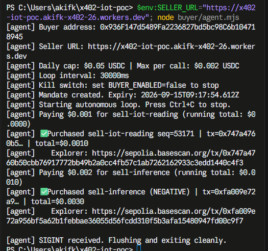
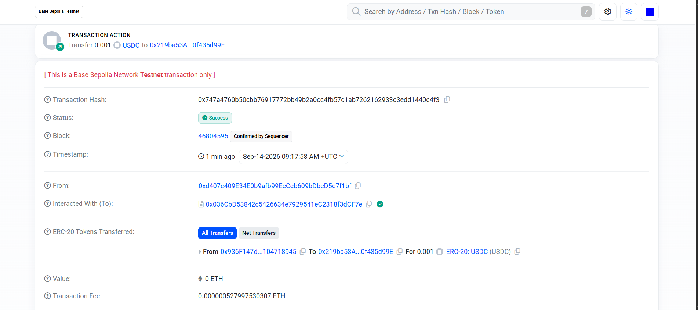
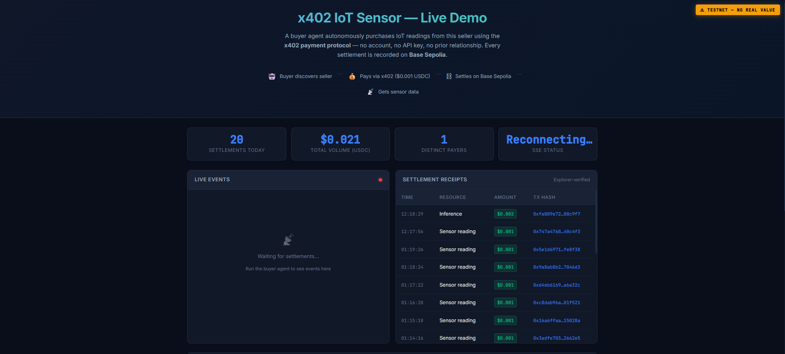

# Evidence: human-run checks, 2026-09-14

Screenshots taken by hand. Each closes a row in [`../OPEN-ITEMS.md`](../OPEN-ITEMS.md)
and [`../PENDING-HUMAN-TESTS.md`](../PENDING-HUMAN-TESTS.md). All three show the
same run: one `node buyer/agent.mjs` against the public Worker, with the Agent
Card key pinned in `.env`. Clock times on screen are local (UTC+3), and the
ledger and explorer times are UTC.

## 1. Signed card and clean exit (A4, B3)

- Two purchases: a reading (tx `0x747a4760…40c4f3`) and an inference (tx `0xfa009e72…00c9f7`).
- **No "Agent Card NOT verified" line.** That warning prints only when no key is
  pinned. A card that fails verification stops the agent before it pays.
- After `Ctrl+C`: `[agent] SIGINT received. Flushing and exiting cleanly.` The
  ledger's last line is
  `{"ts":"2026-09-14T09:18:58.791Z","result":"agent_stopped","signal":"SIGINT"}`.

## 2. The first purchase on the block explorer (B4)

- Status **Success**, block 46804595, 2026-09-14 09:17:58 UTC.
- **ERC-20 Tokens Transferred:** 0.001 USDC from `0x936F…8945` (buyer) to
  `0x219b…d99E` (seller).
- The transaction-level **From** is `0xd407…f1bf`, not the buyer. It is the
  facilitator's relayer. Under EIP-3009 the buyer only signs an authorization,
  and the facilitator submits it and pays the gas. The token transfer row is where
  buyer → seller shows.

## 3. The same two purchases on the demo page

- The top two receipts are the purchases above: Inference $0.002 at 12:18:29 and
  Sensor reading $0.001 at 12:17:56 (local time).
- The rows below them, 01:14–01:19 local, are the end of the 2026-09-11
  unattended run.
- **Visible on this screenshot, and not hidden:** the SSE status reads
  `Reconnecting…` and the live-events panel is empty. The receipts table loads
  over plain HTTP. The live stream had dropped when the screenshot was taken, so
  this screenshot is evidence for the receipts and not for live streaming.
- **The stat cards on this screenshot are mislabelled, and the screenshot showed
  why.** "Settlements today: 20" on a day with two purchases. The page counted
  the last 20 receipts it had fetched. The SSE handler also kept a second,
  since-page-load counter that overwrote the cards between polls. Fixed the same
  day (deploy `2f6250e0`): the cards now read "Recent settlements (last 20)",
  "Volume, last 20" and "Payers, last 20", and one code path writes them. The
  screenshot is kept as taken.
