# 🤖 A2A + x402: Agent'lar Nasıl Konuşur ve Birbirine Ödeme Yapar?

> **Kaynaklar:** [A2A Protocol](https://google.github.io/A2A/), [x402 Extensions](https://docs.x402.org/extensions/overview), [x402 HTTP 402](https://docs.x402.org/core-concepts/http-402)

---

## 1. Büyük Resim — 3 Saniyede

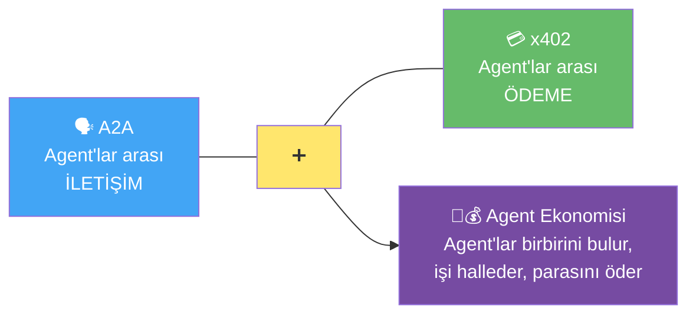

**Tek cümle:** A2A = agent'ların **konuşma dili**, x402 = agent'ların **cüzdanı**. İkisi birleşince agent'lar hem iş yapabilir hem ödeme alabilir.

---

## 2. A2A Nedir? — Basit Benzetme

**A2A (Agent-to-Agent)** = Google'ın başlattığı, AI agent'ların birbirini **keşfetmesini**, **görev vermesini** ve **sonuç almasını** sağlayan açık standart.

### 🏢 Ofis Benzetmesi

```mermaid
graph TD
    subgraph "🏢 Bir Şirket Düşün"
        CEO["👔 CEO Agent\n(Orkestratör)"]
        DEV["👨‍💻 Yazılımcı Agent"]
        DES["🎨 Tasarımcı Agent"]
        ACC["📊 Muhasebeci Agent"]
    end

    CEO -->|"Logo tasarla"| DES
    CEO -->|"API yaz"| DEV
    CEO -->|"Fatura kes"| ACC
    DES -->|"Logo hazır ✅"| CEO
    DEV -->|"API hazır ✅"| CEO
    ACC -->|"Fatura kesildi ✅"| CEO

    style CEO fill:#764ba2,color:#fff
    style DEV fill:#42a5f5,color:#fff
    style DES fill:#f093fb,color:#fff
    style ACC fill:#66bb6a,color:#fff
```

A2A olmadan bu agent'lar birbirinin **dilini bilmez**. Her biri farklı framework'te (LangGraph, CrewAI, custom) çalışır. A2A hepsine ortak bir dil verir.

> [!TIP]
> **A2A vs MCP farkı:**
> - **MCP** = Agent'ı **araçlara** bağlar (veritabanı, API, dosya sistemi)
> - **A2A** = Agent'ı **diğer agent'lara** bağlar (iletişim, görev delegasyonu)

---

## 3. ⭐ Agent Card — Agent'ın Kartviziti

Her A2A agent'ının bir **Agent Card**'ı vardır. Bu, agent'ın kim olduğunu, ne yapabildiğini ve nasıl erişileceğini anlatan bir JSON dosyasıdır.

### Nerede Bulunur?

```
https://agent.example.com/.well-known/agent.json
```

### Agent Card Yapısı

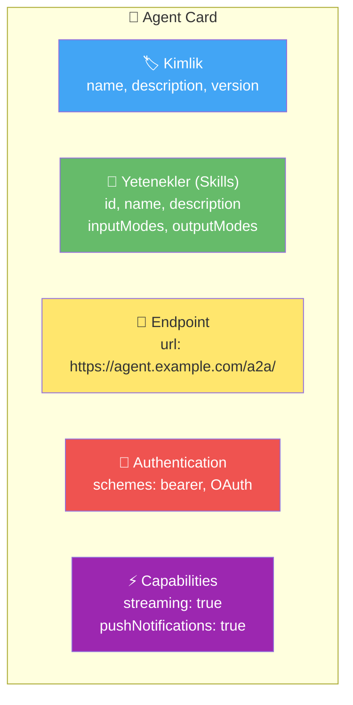

### Gerçek Bir Agent Card Örneği

```json
{
  "name": "weather-agent",
  "description": "Dünya genelinde hava durumu sorgulama agent'ı",
  "url": "https://weather-agent.example.com/a2a/",
  "version": "1.0.0",
  "capabilities": {
    "streaming": true,
    "pushNotifications": false
  },
  "defaultInputModes": ["text"],
  "defaultOutputModes": ["text", "data"],
  "skills": [
    {
      "id": "current-weather",
      "name": "Anlık Hava Durumu",
      "description": "Belirtilen şehir için anlık hava durumu verir",
      "inputModes": ["text"],
      "outputModes": ["text", "data"]
    },
    {
      "id": "forecast",
      "name": "5 Günlük Tahmin",
      "description": "5 günlük hava durumu tahmini",
      "inputModes": ["text"],
      "outputModes": ["text", "data"]
    }
  ],
  "authentication": {
    "schemes": ["bearer"]
  }
}
```

### Benzetme: LinkedIn Profili

| Agent Card Alanı | LinkedIn Karşılığı |
|---|---|
| `name` | Profil adı |
| `description` | Hakkımda bölümü |
| `skills` | Yetenekler listesi |
| `url` | İletişim bilgisi |
| `authentication` | Bağlantı isteği / Premium |
| `capabilities` | "Mesajlara açık" durumu |

---

## 4. ⭐ Task Lifecycle — Görev Yaşam Döngüsü

A2A'da tüm işler **Task** (görev) olarak modellenir. Her görev bir durum makinesinden (state machine) geçer.

### Durum Şeması

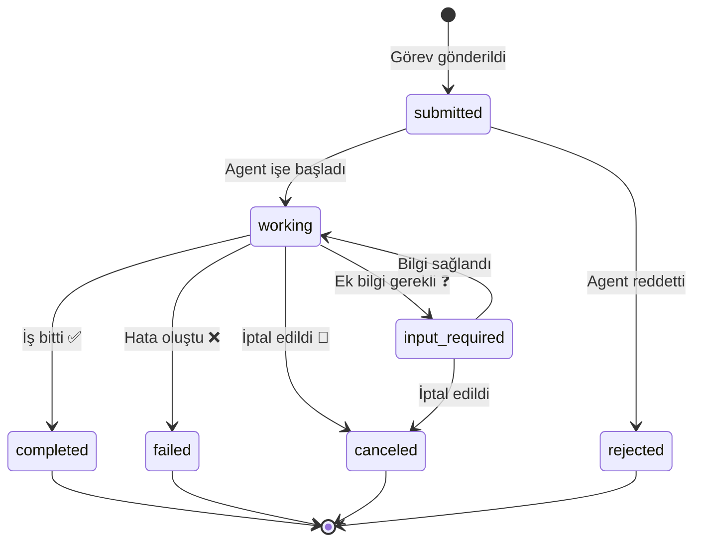

### Her Durum Ne Anlama Geliyor?

| Durum | Emoji | Anlamı | Gerçek Hayat Karşılığı |
|-------|-------|--------|----------------------|
| **`submitted`** | 📬 | Görev alındı, henüz başlanmadı | Sipariş onaylandı |
| **`working`** | ⚙️ | Agent işi yapıyor | Kargo hazırlanıyor |
| **`input-required`** | ❓ | Agent ek bilgi istiyor | "Hangi beden?" sorusu |
| **`completed`** | ✅ | İş başarıyla bitti | Kargo teslim edildi |
| **`failed`** | ❌ | Hata oluştu | Ürün stokta yok |
| **`canceled`** | 🚫 | Client iptal etti | Sipariş iptal edildi |
| **`rejected`** | 🛑 | Agent görevi reddetti | "Bu işi yapamam" |

### Akış Örneği: Tercüme Görevi

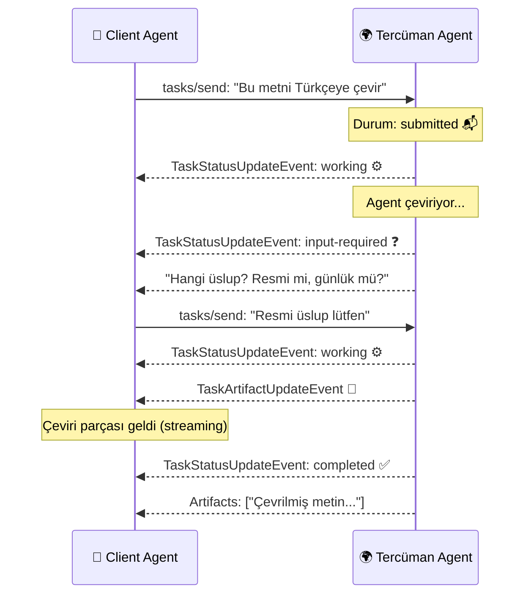

### Task'ın Temel Bileşenleri

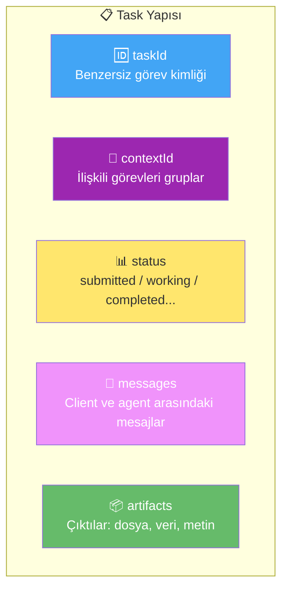

---

## 5. ⭐⭐ A2A + x402 Nasıl Birleşir (Compose)?

İşte en önemli kısım. İki protokol birbirini **tamamlar**, **çakışmaz**.

### Katmanlı Yapı

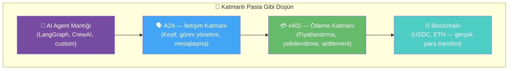

| Katman | Protokol | Ne Yapar? | Olmasa? |
|--------|----------|-----------|---------|
| İletişim | A2A | Agent'lar birbirini bulur ve konuşur | Agent'lar birbirinin varlığından habersiz |
| Ödeme | x402 | Agent'lar birbirine ödeme yapar | Hizmet bedava olmak zorunda |
| Altyapı | Blockchain | Paranın gerçekten el değiştirmesi | Güven mekanizması yok |

### Anahtar Prensip: A2A Ödemeden Habersiz

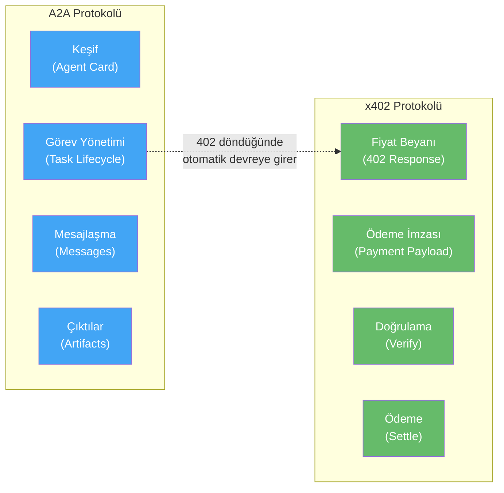

> [!IMPORTANT]
> A2A çekirdek spesifikasyonu **ödeme hakkında hiçbir şey bilmez**. Bilinçli olarak "ödeme agnostik" tasarlanmıştır. x402 bir **uzantı (extension)** olarak ödeme katmanını ekler.

---

## 6. ⭐⭐⭐ Gerçek Senaryo: Agent Bir Agent'ı Kiralar

Bir seyahat planlama agent'ı, hava durumu agent'ına ücretli sorgu yapar:

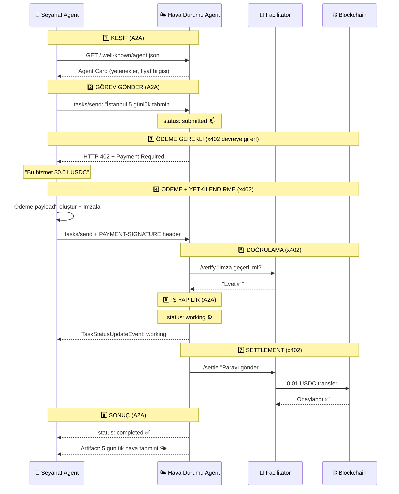

### Adım Adım — Kim Ne Yapıyor?

| Adım | Protokol | Ne Oluyor? |
|------|----------|------------|
| 1. Keşif | **A2A** | Agent Card okunur, yetenekler öğrenilir |
| 2. Görev | **A2A** | Task oluşturulur, `submitted` durumuna geçer |
| 3. 402 Yanıtı | **x402** | "Bu iş ücretli" sinyali verilir |
| 4. İmzalama | **x402** | Client ödeme talimatını imzalar (mandate) |
| 5. Doğrulama | **x402** | Facilitator imzayı kontrol eder |
| 6. İş Yürütme | **A2A** | Task `working` durumunda, agent çalışıyor |
| 7. Ödeme | **x402** | Para blockchain'e yazılır |
| 8. Sonuç | **A2A** | Task `completed`, artifact teslim edilir |

---

## 7. Agent Card + x402 Fiyat Bilgisi

x402 extension'ı sayesinde Agent Card'a ödeme bilgileri de eklenebilir:

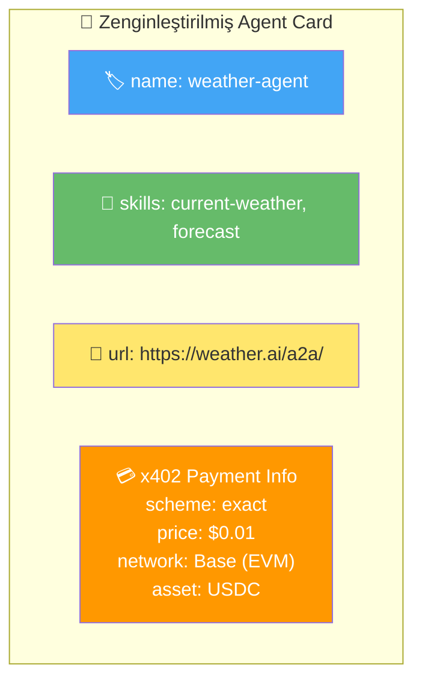

Bu sayede keşif aşamasında **fiyat da görülebilir** — agent "bu hizmet kaça?" diye önceden bilir.

---

## 8. Neden İkisi Birlikte Güçlü?

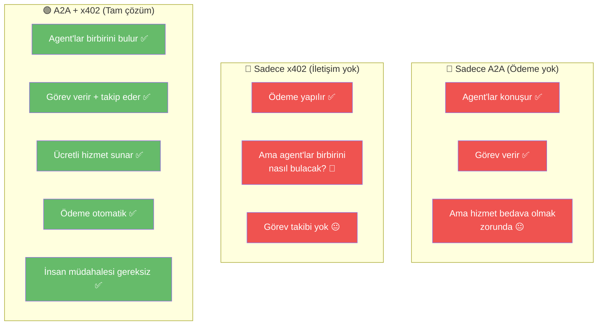

---

## 9. Büyük Benzetme: Freelancer Platformu

Tüm sistemi bir **freelancer platformu** gibi düşün:

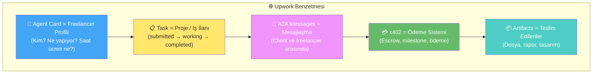

| Upwork | A2A + x402 |
|--------|------------|
| Freelancer profili | Agent Card |
| Proje oluştur | Task `submitted` |
| Freelancer çalışıyor | Task `working` |
| "Ek bilgi lazım" mesajı | Task `input-required` |
| Teslim + Ödeme | Task `completed` + x402 settle |
| Proje iptal | Task `canceled` |

---

## 10. Özet Şeması

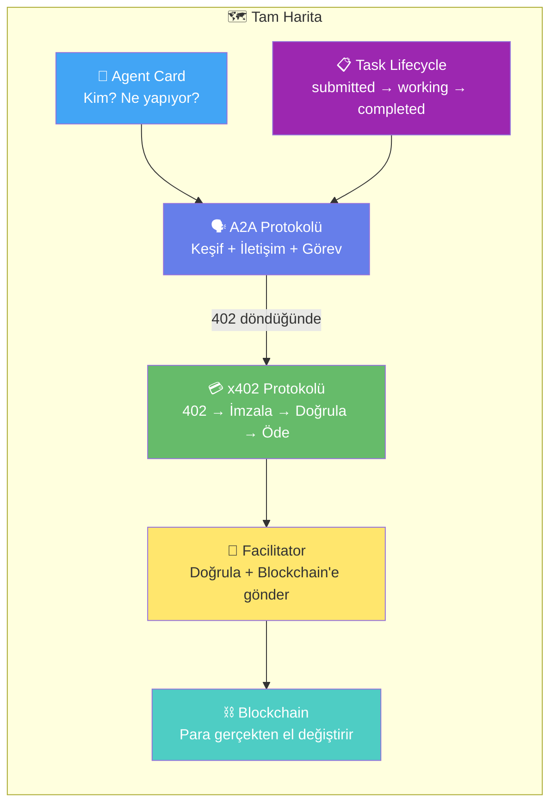

---

## 🎓 Kavram Sözlüğü

| Terim | Anlamı |
|-------|--------|
| **A2A** | Agent-to-Agent — agent'ların iletişim ve keşif protokolü |
| **Agent Card** | Agent'ın kimliğini, yeteneklerini ve erişim bilgisini gösteren JSON kartvizitidir |
| **Task** | A2A'da iş birimi — bir görevin yaşam döngüsü vardır |
| **TaskState** | Görevin mevcut durumu (submitted, working, completed, failed...) |
| **Artifact** | Görev sonucunda üretilen çıktı (dosya, veri, metin) |
| **contextId** | İlişkili görevleri bir arada tutan kimlik — çok turlu konuşmalar için |
| **Skill** | Agent Card'daki yetenek tanımı — agent'ın ne yapabildiği |
| **x402 Extension** | A2A'ya ödeme katmanı ekleyen uzantı |
| **HTTP 402** | "Bu hizmet ücretli, öde" sinyali |
| **Compose** | İki protokolün birbirini tamamlayarak birlikte çalışması |
| **MCP** | Model Context Protocol — agent'ı araçlara bağlar (A2A'dan farklı) |

---

> [!NOTE]
> Önceki rehberlere de göz at:
> - [Facilitator Rehberi](file:///C:/Users/akifk/.gemini/antigravity/brain/6a5ae049-f8af-47f4-af70-062c50724513/facilitator_rehberi.md) — Facilitator'ın detaylı açıklaması
> - [Mandate & Authorization Rehberi](file:///C:/Users/akifk/.gemini/antigravity/brain/6a5ae049-f8af-47f4-af70-062c50724513/mandate_authorization_settlement_rehberi.md) — Intent vs Cart, Auth ≠ Settlement
