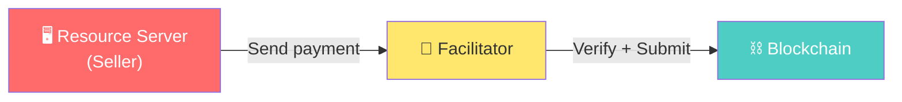
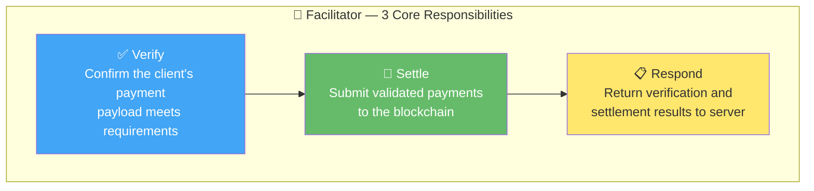
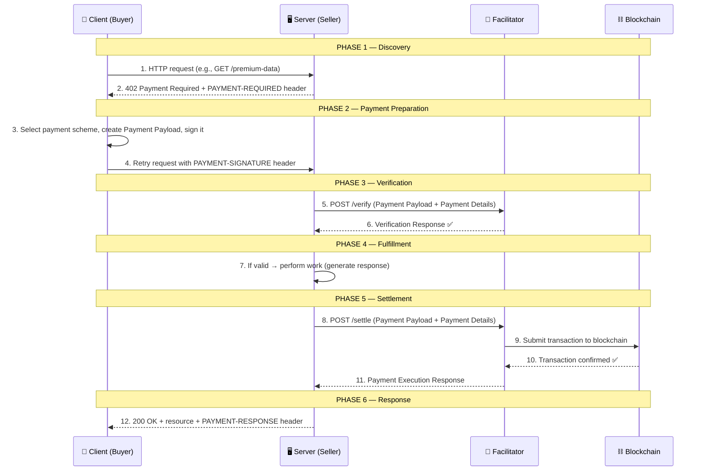
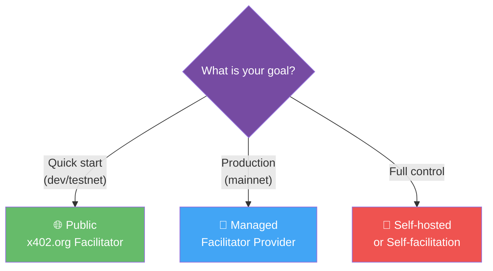
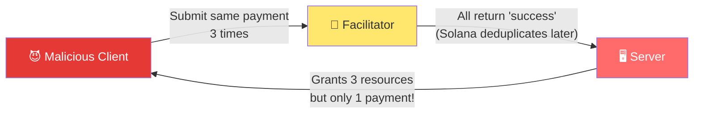
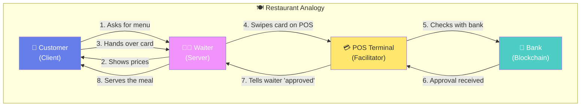
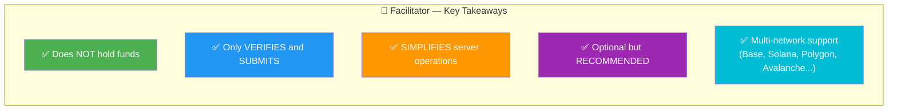

# 🧭 x402 Facilitator — Comprehensive Guide

> **Source:** [docs.x402.org/core-concepts/facilitator](https://docs.x402.org/core-concepts/facilitator)

---

## 1. What is a Facilitator?

**Facilitator = A service that verifies payments and submits them to the blockchain on behalf of the server.**

The facilitator is an **optional but recommended** intermediary in the x402 protocol. It removes the need for resource servers (sellers) to maintain direct blockchain connectivity.

> [!TIP]
> The facilitator **does not hold funds** and is **not a custodian**. It only performs verification and execution of onchain transactions based on signed payloads provided by clients.

---

## 2. Why Use a Facilitator?

Without a facilitator, the resource server must:
- Run blockchain nodes
- Implement payment verification logic
- Manage gas fees and transaction monitoring

With a facilitator, the server simply says *"verify this payment and settle it"* — all blockchain complexity is abstracted away.

| Benefit | Description |
|---------|-------------|
| **Reduced complexity** | Servers don't interact directly with blockchain nodes |
| **Protocol consistency** | Standardized verify/settle flows across services |
| **Faster integration** | Start accepting payments with minimal blockchain-specific code |

---

## 3. Facilitator Responsibilities

| Responsibility | What it does | Analogy |
|----------------|-------------|---------|
| **Verify** | Checks if the client's payment payload is valid (signature, balance, conditions) | Cashier holding a bill up to the light to check if it's real |
| **Settle** | Submits the verified payment to the blockchain and waits for confirmation | Cashier depositing the money into the register |
| **Respond** | Reports the result back to the server — success or failure | Cashier telling the manager "payment confirmed" |

---

## 4. End-to-End Interaction Flow

This is the complete lifecycle of a paid HTTP request using a facilitator:

### Step-by-Step Breakdown

| Step | Actor | Action | Protocol Element |
|------|-------|--------|-----------------|
| 1 | Client → Server | Initial HTTP request | Standard HTTP |
| 2 | Server → Client | 402 + payment requirements (Base64-encoded) | `PAYMENT-REQUIRED` header |
| 3 | Client | Selects a `paymentDetails` entry, creates payload based on `scheme` | Payment Payload |
| 4 | Client → Server | Retries request with signed payment | `PAYMENT-SIGNATURE` header |
| 5 | Server → Facilitator | Sends payload + details to `/verify` | Facilitator API |
| 6 | Facilitator → Server | Returns verification result | Verification Response |
| 7 | Server | Performs work if verification passed | Business logic |
| 8 | Server → Facilitator | Sends payload + details to `/settle` | Facilitator API |
| 9-10 | Facilitator ↔ Blockchain | Submits tx, waits for confirmation | Onchain settlement |
| 11 | Facilitator → Server | Returns settlement result | Payment Execution Response |
| 12 | Server → Client | Returns resource + settlement receipt | `PAYMENT-RESPONSE` header |

---

## 5. Choosing a Facilitator Path

| Goal | Recommended Path | Notes |
|------|-----------------|-------|
| Fastest testnet/local quickstart | Public `x402.org` facilitator | Free, easy, **dev/testnet only** |
| Managed production deployment | Production facilitator provider | Supports your target network |
| Full operational control | Self-host or self-facilitate | See [self-facilitation example](https://github.com/x402-foundation/x402/tree/main/examples/typescript/servers/self-facilitation) |

> [!WARNING]
> The public `x402.org` facilitator is intended **for development and testnet only**. Do not use it for production mainnet deployments.

---

## 6. Live Facilitators

Multiple facilitators are live in production, supporting various networks:

- **Base** (EVM)
- **Solana** (SVM)
- **Polygon** (EVM)
- **Avalanche** (EVM)
- And more — see [Facilitators directory](https://docs.x402.org/dev-tools/facilitators)

---

## 7. Solana Duplicate Settlement Protection

On Solana, a **race condition** can occur when the same payment transaction is submitted to `/settle` multiple times before the first is confirmed onchain.

**Mitigation:** The x402 SVM packages include a built-in `SettlementCache`:
- Short-lived in-memory cache (120 seconds)
- Detects and rejects duplicate settlement attempts
- **Enabled by default** in TypeScript and Python
- In Go, a shared `SettlementCache` instance should be passed during registration

> [!CAUTION]
> If you are a merchant settling payments directly (without a facilitator), you **must** implement equivalent duplicate detection yourself.

---

## 8. Restaurant Analogy

| Restaurant | x402 Protocol |
|------------|--------------|
| Customer hands over card | Client sends signed payment payload |
| Waiter swipes on POS | Server sends verify request to facilitator |
| POS gets bank approval | Facilitator verifies on blockchain |
| Meal is served | Resource/data is returned |

---

## 9. Summary

---

## 📖 Glossary

| Term | Definition |
|------|-----------|
| **Client (Buyer)** | The party requesting access to a paid resource |
| **Server (Seller)** | The party providing the paid resource |
| **Facilitator** | Intermediary service that verifies and settles payments on behalf of the server |
| **Verify** | Checking whether a payment payload is valid (signature, balance, conditions) |
| **Settle** | Submitting a verified payment to the blockchain and waiting for confirmation |
| **402 Payment Required** | HTTP status code signaling "this resource requires payment" |
| **Payment Payload** | The signed payment data package created by the client |
| **PAYMENT-REQUIRED** | HTTP header (server → client) containing Base64-encoded payment requirements |
| **PAYMENT-SIGNATURE** | HTTP header (client → server) containing the Base64-encoded signed payment |
| **PAYMENT-RESPONSE** | HTTP header (server → client) containing the Base64-encoded settlement result |
| **Settlement Cache** | In-memory protection against duplicate settlement (Solana-specific) |
| **Base Sepolia** | Ethereum L2 testnet used for development with x402 |

---

> **Further Reading:**
> - [Client / Server roles](https://docs.x402.org/core-concepts/client-server)
> - [HTTP 402 details](https://docs.x402.org/core-concepts/http-402)
> - [Payment Schemes](https://docs.x402.org/schemes/overview)
