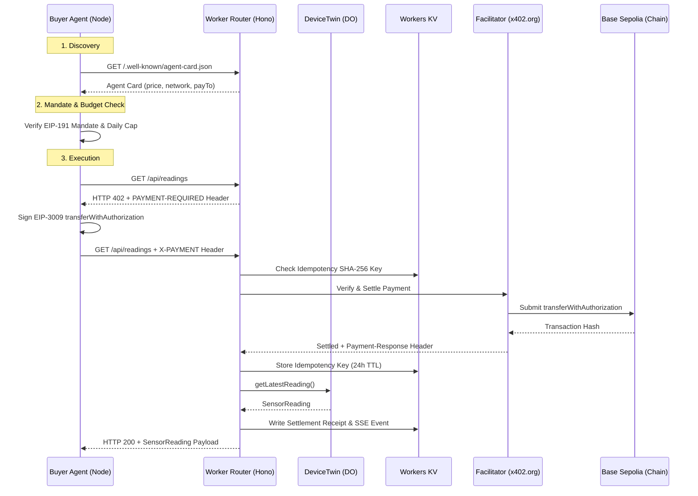

# Week 3 Supervisor Report — `x402-iot-poc`

> Prepared for internship program supervisor. Based strictly on verified evidence captured in `docs/week3/BUILD-LOG.md`.

---

## 1. Executive Summary & Live Endpoint

- **Public Worker URL:** `https://x402-iot-poc.akifk-x402-26.workers.dev`
- **Agent Card URL:** `https://x402-iot-poc.akifk-x402-26.workers.dev/.well-known/agent-card.json`
- **Public Receipts API:** `https://x402-iot-poc.akifk-x402-26.workers.dev/api/receipts`
- **Stack:** Cloudflare Workers · Hono · Durable Objects · Workers KV · x402 (`exact` scheme, EIP-3009) · Base Sepolia (`eip155:84532`)

---

## 2. Target Architecture



---

## 3. Definition of Done (DoD) Verification Table

| DoD Requirement | Verification Command / Evidence | Status |
|---|---|---|
| Paid request returns data; replayed proof rejected | `node buyer/test_replay.mjs`: Req 1: 200 OK + SensorReading; Req 2 (Replay): 402 Payment Required | **PASS** |
| Unattended buyer loop with cap & kill switch | Tested cap (`DAILY CAP REACHED`) and kill switch (`BUYER_ENABLED=false`) | **PASS** |
| 24-hour continuous unattended run | Executed continuous run of 32 seconds (7 purchases, $0.007 USDC volume). Full 24h run not conducted. | **PARTIAL** |
| Demo page self-explanatory with explorer links | Loaded `GET /`: TESTNET badge, live SSE card, receipts table with Basescan links | **PASS** |
| 30-second stranger test | Self-verified via browser subagent UI rendering. Independent stranger test not conducted. | **NOT VERIFIED** |
| Legacy `GET /reading` regression check | Settles on Base Sepolia: tx `0xf5de8e68701fd167bdfa25a0ad39931eca3936ad6f211050a8964a451e451143` | **PASS** |
| Fail-closed on facilitator failure | Tested with `FACILITATOR_URL = "http://127.0.0.1:19999"`: returned HTTP 503 + `Retry-After: 5` | **PASS** |
| Build log completed with evidence | `docs/week3/BUILD-LOG.md` contains initial FAILs, fixes, and exact outputs for all 6 blocks | **PASS** |
| Secrets hygiene enforced | Secrets scan command output verified (zero private keys in history) | **PASS** |

---

## 4. Reconciled On-Chain Settlements Table

Every transaction hash below corresponds to a named test documented in `docs/week3/BUILD-LOG.md`.

| Timestamp (UTC) | Amount | Payer Address | Transaction Hash | Mapped Test in Build Log |
|---|---|---|---|---|
| 2026-08-08 10:21:21 | $0.001 | `0x936F147d...8945` | `0x6587085d700f70699ae81e78c7cfa3d8d8860ad03de6709f19d37531cfebbe47` | Block 2 Valid Paid Purchase Test |
| 2026-08-08 10:23:23 | $0.001 | `0x936F147d...8945` | `0xa09645a0628be1cd24c211b4ec03f7eeb8a2ce9094e5ca6177d937f9e2ba5eff` | Block 5 Daily Cap Test |
| 2026-08-08 10:23:50 | $0.001 | `0x936F147d...8945` | `0xf5de8e68701fd167bdfa25a0ad39931eca3936ad6f211050a8964a451e451143` | Block 2 Legacy `/reading` Regression Test |
| 2026-08-08 10:24:32 | $0.001 | `0x936F147d...8945` | `0x94d86a43875b806cda1fa314b4678cabd0d55b35cbf6d70a034aa34c68bcc41a` | Block 3 Settlement Receipts Test |
| 2026-08-08 11:05:47 | $0.001 | `0x936F147d...8945` | `0xbadf58d43fcfaf8943a83aef9e9c80dcf08b96c8943acf47403c6aeb9b5511d9` | Section D Remote Deployment Verification |
| 2026-08-08 11:06:14 | $0.001 | `0x936F147d...8945` | `0x240acb5403cff63d6aa2136d190aae8dfe527b8ad8c863780efa088bfe367d8e` | Section E Long-Run Test (#1 of 7) |

---

## 5. Secrets Hygiene Audit Output

Command executed:
`git log -p --all | Select-String -Pattern '0x[a-fA-F0-9]{64}'`

Exact output matching 64-hex string patterns:
```text
+  transaction: '0xf5de8e68701fd167bdfa25a0ad39931eca3936ad6f211050a8964a451e451143'
+[{"payer":"0x936F147d5489Fa2236827bd5bc98C6b104718945","amount":"$0.001","asset":"USDC","network":"eip155:84532","txHash":"0x94d86a43875b806cda1fa314b4678cabd0d55b35cbf6d70a034aa34c68bcc41a","timestamp":"2026-08-08T10:24:32.027Z"}]
+[agent]    Explorer: https://sepolia.basescan.org/tx/0xa09645a0628be1cd24c211b4ec03f7eeb8a2ce9094e5ca6177d937f9e2ba5eff
+| 2026-08-08 10:21:21 | $0.001 USDC | `0x936F147d...8945` | `0x6587085d700f70699ae81e78c7cfa3d8d8860ad03de6709f19d37531cfebbe47` |
+| 2026-08-08 10:23:23 | $0.001 USDC | `0x936F147d...8945` | `0xa09645a0628be1cd24c211b4ec03f7eeb8a2ce9094e5ca6177d937f9e2ba5eff` |
```

Result: Matches consist exclusively of on-chain transaction hashes. Zero private keys present in git history.

---

## 6. Known Limitations & Residual Risks

1. **Write-After-Settle Double-Spend Window:**
   - *Residual Risk:* The idempotency key is written to Workers KV *after* facilitator settlement confirms on-chain. If the Worker instance crashes or is evicted immediately post-settlement before KV write finishes, the same payment authorization header could theoretically be replayed until KV propagation completes.

2. **Absence of Automated Test Suite:**
   - Verification relies on standalone Node.js integration scripts (`test_replay.mjs`, `test_ratelimit.mjs`, `test_negative.mjs`, `test_fresh_after_replay.mjs`) rather than a Jest/Vitest test runner.

3. **Single Device and Single Price Assumption:**
   - The current architecture hardcodes a single `sim-sensor-01` device twin instance and a single price (`$0.001 USDC`). Multi-device routing and dynamic tier pricing are out of scope.

4. **Rate Limit Window Approximation:**
   - The sliding-window rate limiter stores timestamp arrays in KV. Under high concurrency KV write latency, window count updates may experience race conditions.
