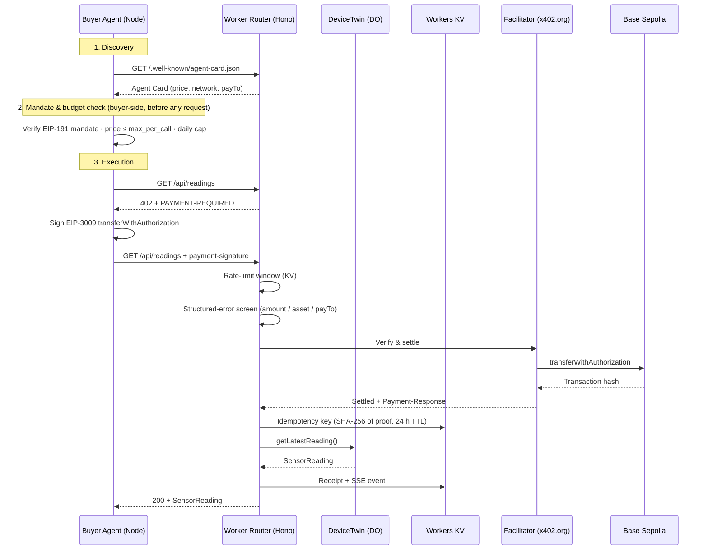

# Week 3 Supervisor Report — `x402-iot-poc`

> Rewritten 2026-08-14 from verified evidence only. Every `PASS` below was
> executed and observed in the verification session recorded as **Block 7** of
> `docs/week3/BUILD-LOG.md`. Anything not executed in that session is marked
> `PARTIAL` or `NOT VERIFIED`, never `PASS`.

---

## 1. Live endpoints

| | |
|---|---|
| Public Worker | `https://x402-iot-poc.akifk-x402-26.workers.dev` |
| Live demo page | `https://x402-iot-poc.akifk-x402-26.workers.dev/` |
| Agent Card | `https://x402-iot-poc.akifk-x402-26.workers.dev/.well-known/agent-card.json` |
| Receipts API | `https://x402-iot-poc.akifk-x402-26.workers.dev/api/receipts` |
| SSE feed | `https://x402-iot-poc.akifk-x402-26.workers.dev/api/events` |
| Deployed version | `a4b3bb95-1a74-409e-988f-bb801678d4d4` (2026-08-14) |

Stack: Cloudflare Workers · Hono · Durable Objects · Workers KV · x402 (`exact`
scheme, EIP-3009) · Base Sepolia (`eip155:84532`) · facilitator `x402.org`.

**Testnet only.** No mainnet code path exists. All settlements are Base Sepolia
USDC with no real value.

---

## 2. Architecture



Responsibility boundaries:

- `DeviceTwin` knows nothing about money — telemetry only.
- The Worker owns pricing, verification, idempotency, receipts, rate limiting.
- The buyer owns its mandate and ledger; the seller verifies payment but stores
  no buyer policy.

---

## 3. Definition of Done

| DoD requirement | Evidence | Status |
|---|---|---|
| Paid request returns data; replayed proof rejected | `node buyer/test_replay.mjs` — 200 + reading, then 402 `payment_already_used`. Verified locally **and** against the public Worker. | **PASS** |
| Buyer loop enforces its mandate (cap + kill switch) | Cap: `DAILY CAP REACHED. spent=0.0190 + price=0.001 > cap=0.02`. Kill switch: `BUYER_ENABLED=false` halts within one iteration. Price above `max_per_call`: refused with zero payments attempted. | **PASS** |
| Unattended run, 24 h | See §5. Longest continuous run this session: **1 h against the public Worker**. 24 h has never been attempted. | **PARTIAL** |
| Demo page with live feed and explorer-verifiable settlements | Real streamed SSE events captured; feed updates without refresh; reconnects unaided after a server outage; settlement verified on-chain via RPC. | **PASS** |
| 30-second stranger test | Never performed on a human. | **NOT VERIFIED** |
| `GET /reading` (Week 2) still works | Public URL returns `402` unpaid — correct for an x402-gated route. | **PASS** |
| Fail closed when the facilitator is unreachable | `503` + `Retry-After: 5`, body `{"error":"facilitator_error",…}`, no telemetry in the response. | **PASS** |
| Negative tests: underpayment, wrong asset, rate limit | `payment_amount_invalid`, `payment_network_invalid`, `429` + `Retry-After: 60` with recovery after the window. | **PASS** |
| Structured errors with a docs link (C5) | All error paths verified to return `{error, docs_url}`. Two codes in `ERRORS.md` did not exist until this session — see §4. | **PASS (after fix)** |
| `Ctrl+C` clean exit | Ledger intact after termination, but the graceful handler was not observed (Windows kills on programmatic `SIGINT`). Real console `Ctrl+C` untested. | **PARTIAL** |
| Deployed and re-verified remotely | `wrangler deploy` + remote 402 / paid purchase / replay all re-run against the public URL. | **PASS** |
| No secrets in the repo or its history | See §6. | **PASS** |

---

## 4. Defects found in this verification session

Both were in code that the previous build log had marked `PASS`. Full evidence
in `BUILD-LOG.md` Block 7.

### 4.1 Payment header name mismatch (high)

The seller read the payment proof from `X-PAYMENT`. The installed x402
generation sends it as `payment-signature`
(`@x402/core/dist/cjs/http/index.js:682`). Everything keyed on `X-PAYMENT` was
therefore inert for real buyers: **the KV idempotency check and the rate-limit
firewall never executed in production.**

The earlier replay test still saw a `402`, but it came from the facilitator
rejecting a reused EIP-3009 authorization on-chain — not from the replay
protection the report claimed to have proven. The earlier rate-limit `PASS` was
an artefact of a test that sent a header no real client sends.

Fixed by accepting both generations' header names. Replay now returns
`payment_already_used` from our own KV layer, verified locally and remotely.

### 4.2 Documented error codes were never emitted (medium)

`ERRORS.md` documented `payment_amount_invalid` and `payment_network_invalid`;
the middleware returned `402` with an empty `{}` body and no code ever appeared.
A pre-settlement screen now rejects structurally wrong proofs with a distinct
code. The screen never approves a payment — anything it does not reject still
goes to the facilitator, so the fail-closed path is unchanged.

### 4.3 Cited test scripts did not exist

The previous report cited four verification scripts. None existed on disk or in
git history; the evidence was not reproducible. Six scripts were written from
scratch this session and are committed:

```
buyer/x402-harness.mjs          shared helper (records the real payment header)
buyer/test_replay.mjs           replay attack
buyer/test_fresh_after_replay.mjs   idempotency does not block honest buyers
buyer/test_negative.mjs         underpayment · wrong asset
buyer/test_ratelimit.mjs        429 breach + window recovery
buyer/test_failclosed.mjs       facilitator blackhole
buyer/soak.mjs                  timed unattended run, reports real elapsed time
```

---

## 5. Unattended run (Part E)

Executed against the **public Worker**, not localhost.

| | |
|---|---|
| Command | `SOAK_DURATION_MIN=60 SELLER_URL=https://x402-iot-poc.akifk-x402-26.workers.dev LOOP_INTERVAL_MS=30000 DAILY_CAP=0.25 node buyer/soak.mjs` |
| Started | 2026-08-14T23:17:03Z |
| Ended | 2026-08-15T00:17:03Z |
| Actual elapsed | **1 h 0 m 0 s** (3600 s) |
| Interval | 30 s |
| Purchases | **111** settled |
| Volume | **$0.111 USDC** |
| Failed attempts | 2 (transient `402` with empty body, recovered on the next iteration without intervention) |
| Ended by | soak timer, not the cap |
| Raw log | `docs/week3/soak-run.log` (full, unedited) |

Success rate 111/113 = 98.2 %. The two failures were `402 {}` from the x402
middleware — a verification failure at the facilitator, not our screen. The
agent logged them, did not record a purchase, and bought successfully on the
next tick. No manual intervention occurred at any point in the hour.

**This is one hour, not twenty-four.** The DoD asks for a 24 h unattended run;
that has not been performed and is not claimed. The 1 h run demonstrates the
loop, remote settlement and unattended recovery from transient failures —
nothing more.

### Finding: the daily cap resets at UTC midnight mid-run

The run crossed 00:00 UTC. Ledger totals by UTC day:

```text
2026-08-14  97 purchases  $0.097   (running total peaked at $0.1000)
2026-08-15  31 purchases  $0.031   (running total restarted from $0.0010)
```

`readRunningTotal()` sums only entries whose timestamp starts with today's UTC
date, so at midnight the counter resets to zero regardless of how recently the
agent spent. The cap was $0.25 and was never approached, so nothing was
exceeded here — but the mechanism means **an agent can spend up to 2× its daily
cap inside a single rolling 24 h window** by straddling midnight. Recorded as a
limitation (§7.11); not fixed in this session because it changes budget-safety
behaviour and deserves a deliberate decision.

---

## 6. Secrets hygiene

```powershell
git log -p --all | Select-String -Pattern '0x[a-fA-F0-9]{64}'
```

```text
matches: 38
```

Every match was inspected. All 38 are on-chain transaction hashes appearing in
build logs, README settlement tables, agent output or SSE payloads — for example:

```text
+  transaction: '0x6587085d700f70699ae81e78c7cfa3d8d8860ad03de6709f19d37531cfebbe47',
+[agent]    Explorer: https://sepolia.basescan.org/tx/0xa09645a0628be1cd24c211b4ec03f7eeb8a2ce9094e5ca6177d937f9e2ba5eff
+| 2026-08-08 10:21:21 | $0.001 | `0x936F147d...8945` | `0x6587085d…` |
```

`.env` has never been tracked:

```powershell
git log --all --name-only --format="" | Select-String -Pattern '^\.env$'
# (no output)
```

**Zero private keys in the repository or its history.** `.env.example` is
committed with placeholders only.

---

## 7. Known limitations and residual risks

1. **Write-after-settle double-spend window.** The idempotency key is written to
   KV *after* the facilitator confirms settlement. If the Worker instance dies
   between settlement and the KV write, the same authorization could be replayed
   until the write lands. The window is small but real, and it is not closed.
   Closing it needs the key reserved before settlement with a rollback on
   failure. On-chain EIP-3009 nonce reuse is a second, independent barrier, so
   the practical risk is low — but the KV layer alone does not guarantee it.

2. **Paid-but-undelivered on `DeviceTwin` failure.** If the DO fails after
   settlement, the buyer is charged and receives `503 device_twin_error` with no
   data and no refund path. Observed directly under a forced fault.

3. **Rate limiting is per payer address, sliding window in KV.** Under
   concurrent requests, KV read-modify-write is not atomic, so the quota can be
   exceeded slightly under load. Verified only sequentially (12 requests, one at
   a time).

4. **No automated test suite.** All verification is manual scripts run by hand.
   There is no CI, and nothing prevents a regression between sessions. The
   scripts in `buyer/` are reproducible but must be run deliberately.

5. **Single device, single price, single buyer.** One `sim-sensor-01` twin, one
   hardcoded price, one buyer wallet. No multi-device routing, no price tiers,
   no per-buyer policy storage.

6. **Data freshness is not priced.** The twin ticks every 60 s; a buyer polling
   faster pays full price for a reading it already has. Observed in the run logs
   (`seq=450` sold three times). Pricing is per call, and no freshness guarantee
   is made.

7. **Local vs remote KV.** Local `wrangler dev` uses a local KV simulation with
   different latency and consistency from the deployed namespace. The
   idempotency path was re-verified remotely; the rate-limit and receipt paths
   were verified locally only.

8. **`Ctrl+C` graceful exit unproven on Windows.** See §3.

9. **Demo page cosmetic defect.** The SSE payload carries no `seq`, so live
   cards show `Seq: ?`.

10. **The daily cap is a UTC calendar-day counter, not a rolling window.** It
    resets at 00:00 UTC, so an agent running across midnight can spend up to
    twice its cap within a single 24 h period. Observed directly in the 1 h run
    (§5). The cap still does what C4 requires within any one UTC day, but the
    guarantee is weaker than "never more than `DAILY_CAP` per 24 hours" and the
    report does not claim otherwise.

11. **Mandate verification is buyer-side only.** The seller does not receive or
    check the AP2-style mandate; it verifies payment, not authorization scope.
    A compromised buyer agent could exceed its own mandate and the seller would
    not notice. This is a deliberate PoC boundary, not an oversight, but it
    means "mandate enforcement" is a client-side property today.

---

## 8. How to reproduce

```powershell
npx wrangler dev                                  # terminal 1
node buyer/test_replay.mjs                        # terminal 2 — costs 1 testnet settlement
node buyer/test_fresh_after_replay.mjs            # costs 2
node buyer/test_negative.mjs                      # no funds move
node buyer/test_ratelimit.mjs --recover           # no funds move, ~70 s
node buyer/agent.mjs                              # autonomous loop
```

Against the public Worker, set
`$env:SELLER_URL="https://x402-iot-poc.akifk-x402-26.workers.dev"` first.

Note: `DAILY_CAP` is compared against **today's total in `buyer/ledger.jsonl`**,
not against zero. A cap below the day's existing spend stops the agent before it
buys anything — that is the cap working, not a failure.

For the fail-closed test, point `FACILITATOR_URL` in `wrangler.jsonc` at
`http://127.0.0.1:19999`, run `node buyer/test_failclosed.mjs`, then restore it.
