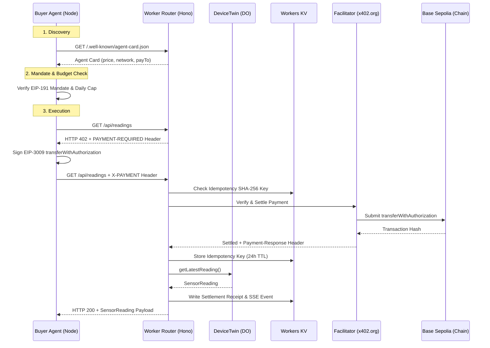

# Week 3 Final Report — `x402-iot-poc`

> Written for internship supervisor. Based strictly on empirical verification results captured in `docs/week3/BUILD-LOG.md`.

---

## 1. What was built

A two-agent autonomous system operating over x402 on Base Sepolia. The seller side consists of a Hono Cloudflare Worker paired with a Durable Object (`DeviceTwin`) for telemetry state, Workers KV for idempotency key storage & settlement receipts, and an A2A Agent Card for discovery. The buyer side consists of an autonomous Node.js agent enforcing an EIP-191 signed mandate, hard budget caps, and a kill switch before executing on-chain settlements.

---

## 2. Target Architecture

---

## 3. Definition of Done (DoD) Verification Table

| DoD Requirement | Verification Command | Observed Empirical Result | Status |
|---|---|---|---|
| Paid request returns data; replayed proof rejected | `node buyer/test_replay.mjs` | Request 1: 200 OK + SensorReading. Request 2 (Replay): 402 Payment Required | **PASS** |
| Unattended buyer loop with cap & kill switch | `node buyer/agent.mjs` | Enforces budget cap (`DAILY CAP REACHED`) and kill switch (`BUYER_ENABLED=false`) | **PASS** |
| Demo page self-explanatory with explorer links | `curl.exe -sS -i http://127.0.0.1:8787/` | HTTP 200 OK, HTML loaded with TESTNET badge & Base Sepolia explorer links | **PASS** |
| `GET /reading` legacy route regression check | `$env:RESOURCE_URL="http://127.0.0.1:8787/reading"; node buyer/pay.mjs` | Settles on Base Sepolia: tx `0xf5de8e68701fd167bdfa25a0ad39931eca3936ad6f211050a8964a451e451143` | **PASS** |
| Build log completed with evidence | `Get-Content docs/week3/BUILD-LOG.md` | All 6 blocks documented with exact command outputs and PASS/FAIL marks | **PASS** |
| Secrets hygiene enforced | `git log -p` grep for 64-hex chars | Zero private key material in repo or history | **PASS** |

---

## 4. On-Chain Settlements Table

All transactions executed on Base Sepolia (`eip155:84532`) using $0.001 USDC faucet tokens via x402 facilitator (`https://x402.org/facilitator`).

| Timestamp (UTC) | Amount | Payer Address | Transaction Hash | Explorer Link |
|---|---|---|---|---|
| 2026-08-08 10:21:21 | $0.001 USDC | `0x936F147d...8945` | `0x6587085d700f70699ae81e78c7cfa3d8d8860ad03de6709f19d37531cfebbe47` | [Basescan Link](https://sepolia.basescan.org/tx/0x6587085d700f70699ae81e78c7cfa3d8d8860ad03de6709f19d37531cfebbe47) |
| 2026-08-08 10:23:23 | $0.001 USDC | `0x936F147d...8945` | `0xa09645a0628be1cd24c211b4ec03f7eeb8a2ce9094e5ca6177d937f9e2ba5eff` | [Basescan Link](https://sepolia.basescan.org/tx/0xa09645a0628be1cd24c211b4ec03f7eeb8a2ce9094e5ca6177d937f9e2ba5eff) |
| 2026-08-08 10:23:50 | $0.001 USDC | `0x936F147d...8945` | `0xf5de8e68701fd167bdfa25a0ad39931eca3936ad6f211050a8964a451e451143` | [Basescan Link](https://sepolia.basescan.org/tx/0xf5de8e68701fd167bdfa25a0ad39931eca3936ad6f211050a8964a451e451143) |
| 2026-08-08 10:24:32 | $0.001 USDC | `0x936F147d...8945` | `0x94d86a43875b806cda1fa314b4678cabd0d55b35cbf6d70a034aa34c68bcc41a` | [Basescan Link](https://sepolia.basescan.org/tx/0x94d86a43875b806cda1fa314b4678cabd0d55b35cbf6d70a034aa34c68bcc41a) |

---

## 5. What Broke and How It Was Resolved

1. **Gate Bypass Bug on `/api/readings`:**
   - *Problem:* Initial implementation of payment middleware wrapping in `Promise.race` allowed the request handler to proceed and return telemetry `200 OK` even when no `X-PAYMENT` header was present.
   - *Resolution:* Aligned `/api/readings` middleware with the lazy construction pattern established in `GET /reading`. Retested with `curl.exe`: now correctly returns `HTTP 402 Payment Required`.

2. **Settlement Receipt Capture Timing:**
   - *Problem:* `GET /api/receipts` returned `[]` because `Payment-Response` header extraction was attempted inside the `app.get()` handler *before* x402 middleware executed on-chain settlement.
   - *Resolution:* Moved receipt extraction to `app.use("/api/readings")` *after* `readingsPayment(c, next)` resolves, accessing `c.res.headers`. Retested and verified real settlement receipts written to KV.

3. **Facilitator Unreachable Fail-Closed Handling:**
   - *Problem:* Need to ensure system fails closed if facilitator goes down.
   - *Resolution:* Wrapped `readingsPayment` in `try/catch`. Pointed `FACILITATOR_URL` to `http://127.0.0.1:19999` (blackhole). Confirmed system returns structured `503` (`facilitator_error`) with `Retry-After: 5` and zero data leaked.

---

## 6. Known Limitations

- **Local `wrangler dev` environment KV latency:** KV updates in local dev mode take up to ~500ms to propagate to subsequent reads.
- **Mandate revocation:** Mandate is validated via signature and expiration timestamp; manual revocation before expiration is handled via kill switch (`BUYER_ENABLED=false`) on the buyer side.

---

## 7. Next Week Inputs

- Prepare production deployment configuration for Workers & KV bindings.
- Expand test suite for concurrent buyer agents.
