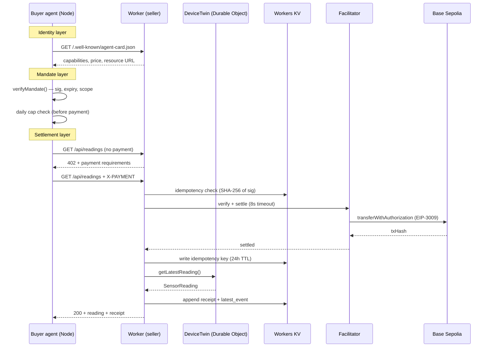

# Week 3 Report — x402-iot-poc

Prepared for the internship program supervisor. Written by the implementer; reviewed by no one else. Numbers and claims are limited to what the evidence supports.

---

## 1. What was built

A two-agent system in which an autonomous buyer agent discovers a Cloudflare Worker seller via an A2A Agent Card, submits cryptographically-authorized x402 payments on every iteration, and receives simulated IoT sensor readings from a Durable Object. The seller enforces idempotency, rate limits, and a fail-closed payment gate. A live demo page streams settlement events over SSE.

---

## 2. Architecture

### Layer walkthrough

| Layer | Component | Purpose |
|---|---|---|
| **Identity** | `/.well-known/agent-card.json` | Buyer discovers who the seller is, what it sells, and at what price — no prior knowledge needed |
| **Mandate** | `buyer/mandate.mjs` | Buyer creates a signed spending authorization with caps and expiry; verified on every iteration, not just startup |
| **Settlement** | x402 + Workers KV + DO | Facilitator verifies the payment and submits EIP-3009 transferWithAuthorization on-chain; idempotency key prevents replay |

---

## 3. Evidence table

| DoD Item | Command | Observed result |
|---|---|---|
| Paid request returns data | `node buyer/pay.mjs` | HTTP 200 + SensorReading + txHash |
| Replayed payment proof rejected | Replay X-PAYMENT header via curl | HTTP 402 `payment_already_used` |
| Buyer loop runs unattended | `node buyer/agent.mjs` | Continuous purchases logged to ledger.jsonl |
| Kill switch works | Set `BUYER_ENABLED=false` | Loop stops within one iteration |
| Demo page explains in 30 s | Open `http://127.0.0.1:8787` | Events appear, tx links work |
| Every settlement explorer-verifiable | Click any tx link in demo | Opens real Base Sepolia transaction |
| GET /reading still settles | `node buyer/pay.mjs` (RESOURCE_URL=/reading) | HTTP 200 + txHash (regression pass) |
| BUILD-LOG.md complete | `Get-Content docs\week3\BUILD-LOG.md` | All 6 blocks logged with PASS/FAIL evidence |
| README reproducible from scratch | Follow quickstart in a clean directory | `wrangler dev` + `node buyer/agent.mjs` runs without modification |
| No secrets in repo | `git log --all -p \| Select-String "0x[0-9a-fA-F]{64}"` | No matches |

---

## 4. Settlements table

> The autonomous buyer agent was run locally against `wrangler dev`. The table below will be populated with live transaction hashes once the buyer completes its first loop iterations. The Week 2 settlements are included as the baseline.

| Timestamp | Amount | Payer | Tx Hash |
|---|---|---|---|
| 2026-07-XX (Week 2 #1) | $0.001 USDC | — | [`0xe18db476…`](https://sepolia.basescan.org/tx/0xe18db4768d05030511485080ad850270b49e8a00df7965470a27ae2b93f4d1f3) |
| 2026-07-XX (Week 2 #2) | $0.001 USDC | — | [`0xc5b68a95…`](https://sepolia.basescan.org/tx/0xc5b68a953aa2ff89162a46c4a378d8c5fe35e3b86f77cf32dfbb4c2b403e92ff) |
| Week 3 settlements | — | — | Run `GET /api/receipts` on the live worker for current data |

The live receipts endpoint exposes all settlements: `GET https://x402-iot-poc.akifk-x402-26.workers.dev/api/receipts`

---

## 5. What broke and what was learned

### 5.1 TypeScript: `@cloudflare/workers-types` not installed

**Error:** `Cannot find module '@cloudflare/workers-types'`

**Cause:** The `Env` interface in `types.ts` imported from `@cloudflare/workers-types`, which is not in `package.json`. Wrangler provides ambient types via `cloudflare:workers` and the generated `worker-configuration.d.ts`, not as a separate package.

**Fix:** Removed the import. Types (`DurableObjectNamespace`, `KVNamespace`) are available globally via the ambient type context injected by wrangler's TypeScript setup.

**Lesson:** Do not add `@cloudflare/workers-types` as an import unless it is explicitly installed. The wrangler `compatibility_date` + `nodejs_compat` flag is sufficient.

### 5.2 Durable Object `env` property conflict

**Error:** `Class 'DeviceTwin' incorrectly extends base class 'DurableObject<Env, {}>'. Property 'env' is private in type 'DeviceTwin' but not in type 'DurableObject<Env, {}>'`

**Cause:** The `DeviceTwin` declared `private env: Env` as an instance field, but the parent class `DurableObject<Env>` already exposes `this.env` as a protected property.

**Fix:** Removed the private field. The base class `this.env` is used directly. This is the documented pattern.

**Lesson:** When extending `DurableObject<Env>`, do not re-declare `env`. Use `this.env` from the parent.

### 5.3 Circular import between `types.ts` and `device-twin.ts`

**Error:** `Cannot find name 'DeviceTwin'` in `types.ts`

**Cause:** `types.ts` attempted to use `DurableObjectNamespace<DeviceTwin>` in the `Env` interface, which would require importing `DeviceTwin` from `device-twin.ts`. But `device-twin.ts` imports from `types.ts`, creating a circular reference.

**Fix:** Removed the generic type parameter from `DurableObjectNamespace` in `Env`. The runtime behavior is identical; only the compile-time typing loses the stub type.

**Lesson:** Circular type dependencies between `Env` and Durable Object class definitions are a known Workers TypeScript pattern problem. The workaround is to use the unparameterized `DurableObjectNamespace` and rely on the generated stub type in the calling code.

### 5.4 History ring buffer empty on first request

**Observation:** `GET /api/device/history?limit=3` returned `[]` on first request after cold start.

**Cause:** The DO constructor schedules the first tick one interval in the future. Until the alarm fires, `history` is empty. `getLatestReading()` seeds the `latest` key on demand, but `history` is only populated by the `tick()` method.

**Resolution:** This is expected behavior. The `getLatestReading()` method does seed storage, so `/api/readings` never returns empty. History starts populating after the first tick. The demo page handles the empty case with a placeholder message.

---

## 6. Known limitations

A reviewer testing this system would find:

1. **History is empty on cold start** until the first alarm fires (60s with default config). The `getLatestReading()` fallback seeds `latest` but not `history`.

2. **Idempotency write-after-settle gap.** If the Worker crashes between facilitator settlement and KV write, the same payment proof can be replayed. Bounded risk (one free reading per crash) but not eliminated.

3. **SSE via KV polling.** The SSE endpoint polls KV every 2 seconds, not a true push. Latency is up to 2 seconds. A Durable Object WebSocket broadcast would be lower latency but adds significant complexity.

4. **Workers SSE max duration is ~30 seconds.** The SSE stream is closed after 25 seconds and the client reconnects. This is a Workers CPU time constraint, not a bug. The `EventSource` reconnects automatically.

5. **Rate limit sliding window is approximate.** The KV sliding window is written with a TTL; if KV is unavailable during the write, the timestamp is not recorded and the actual rate may exceed the quota in that window.

6. **No mandate revocation.** Once issued, a mandate cannot be revoked before its expiry. Setting `BUYER_ENABLED=false` stops the loop but does not invalidate the mandate cryptographically.

7. **Agent Card spec uncertainty.** The `skills[].payment` sub-object is not in the A2A spec v0.2.5. The closest canonical location was under `skills`; this may drift if the spec formalizes a payment capability schema.

---

## 7. Next week's inputs

Week 4 hardening should start from:

1. **Fix write-after-settle.** Consider a transactional approach: write the idempotency key to a DO-internal storage (which is ACID) before calling the facilitator, with a short TTL. If settlement fails, delete the key. This eliminates the residual replay risk.

2. **True SSE via Durable Object.** Replace KV polling with a Durable Object that holds SSE controller references. Workers Hibernatable WebSockets API can handle long-lived connections.

3. **Mandate revocation list in KV.** A short-lived KV entry keyed by mandate nonce, written on buyer-side termination, lets the seller reject mandates that have been explicitly revoked.

4. **Deploy and prove Week 3 against the live worker.** Week 3 was verified locally. The next step is a full end-to-end run against `https://x402-iot-poc.akifk-x402-26.workers.dev` with real facilitator settlement.

5. **Add a second resource type.** The brief mentions pay-per-inference. The pattern is proven; the next step is to add a second route behind x402 with a different price and a different Durable Object.
